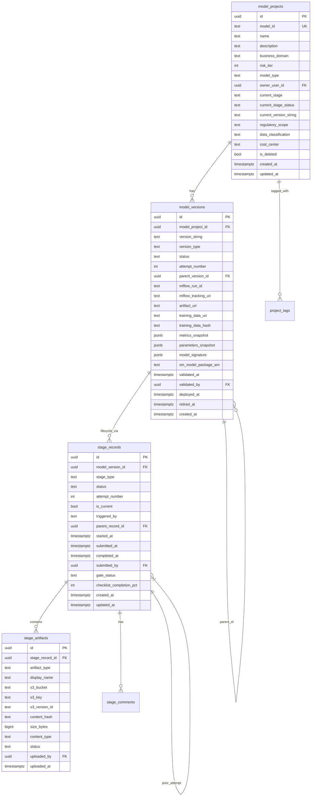
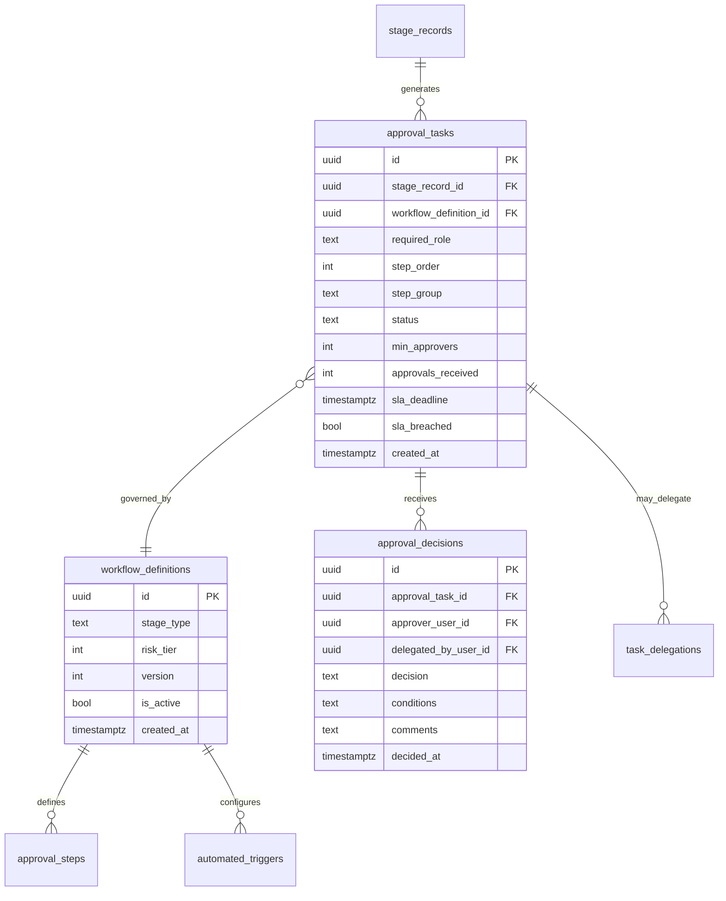
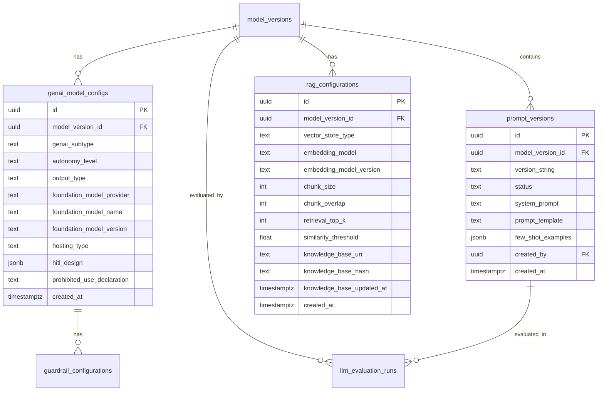
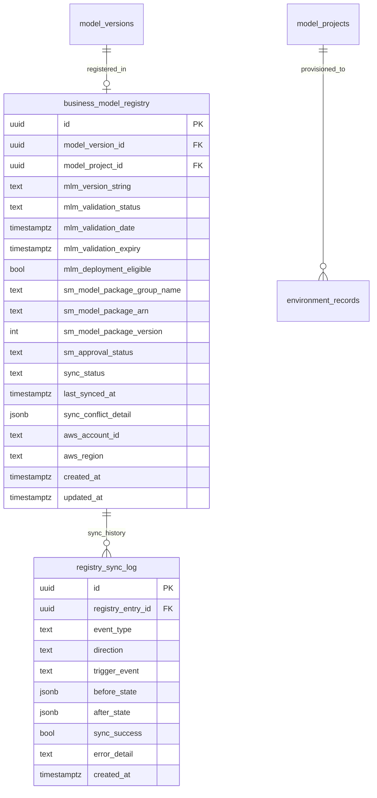

# Data Model Document (DMD)
## Model Lifecycle Management (MLM) Platform

**Document ID:** MLM-DMD-001  
**Version:** 1.0 (with CWE addendum supersessions — see below)  
**Status:** Draft  
**Classification:** Internal — Confidential  
**Schema Depth:** Option B — Logical + Key Physical Details  

**Related Documents:**
- `MLM-FRD-001` — Functional Requirements Document (Section 16: Conceptual Data Model)
- `MLM-SRD-001` — System Requirements Document (Section 6: Data Architecture)
- `MLM-SAD-001` — Storage Architecture Document
- `MLM-IDD-001` — Integration Design Document
- `MLM-CWE-001` — Configurable Workflow Engine Addendum *(extends this document)*

---

> ## ⚠ Partial Supersession Notice
>
> **Extended by:** `MLM-CWE-001` — Configurable Workflow Engine Addendum  
> **Date:** 2024-Q4  
>
> The following sections have been **extended** by the CWE addendum. The tables defined here remain valid but are supplemented by additional tables defined in CWE Section 8:
>
> | Section | Status | Extended By |
> |---------|--------|-------------|
> | Section 4.2 — `workflow_definitions` table | **Superseded** | CWE Section 8.2 — `workflow_templates` table replaces this |
> | Section 4.3 — `approval_steps` table | **Superseded** | CWE Section 8.7 — `approval_level_definitions` + `approver_role_configs` |
> | Section 4.4 — `approval_tasks` table | **Extended** | CWE Section 8 adds `template_stage_id` linkage |
> | Section 3.2 — `model_projects` table | **Extended** | CWE Section 8.12 adds `workflow_template_id`, `workflow_template_version`, `workflow_template_snapshot` |
> | Section 3.4 — `stage_records` table | **Extended** | CWE Section 8.13 adds `template_stage_id` |
>
> **New tables defined only in CWE Section 8 (not in this document):**
> `workflow_templates`, `template_stage_definitions`, `attribute_groups`,  
> `attribute_schemas`, `approval_level_definitions`, `approver_role_configs`,  
> `checklist_item_definitions`, `gate_rules`, `stage_attribute_values`, `checklist_item_states`

---

## Document Control

| Version | Date | Author | Change Description |
|---------|------|--------|-------------------|
| 1.0 | 2024-Q4 | Architecture / Data Team | Baseline release |

### Review & Approval

| Role | Name | Status |
|------|------|--------|
| Enterprise Architect | TBD | Pending |
| Lead Engineer | TBD | Pending |
| DBA | TBD | Pending |
| Security Architect | TBD | Pending |

---

## Table of Contents

1. [Data Model Overview](#1-data-model-overview)
2. [Design Decisions & Conventions](#2-design-decisions--conventions)
3. [Schema: mlm\_core — Lifecycle Entities](#3-schema-mlm_core--lifecycle-entities)
4. [Schema: mlm\_workflow — Workflow & Approvals](#4-schema-mlm_workflow--workflow--approvals)
5. [Schema: mlm\_audit — Immutable Audit Log](#5-schema-mlm_audit--immutable-audit-log)
6. [Schema: mlm\_genai — GenAI & LLM Extensions](#6-schema-mlm_genai--genai--llm-extensions)
7. [Schema: mlm\_registry — Business Model Registry & SM Sync](#7-schema-mlm_registry--business-model-registry--sm-sync)
8. [Schema: mlm\_monitoring — Alerts & Incidents](#8-schema-mlm_monitoring--alerts--incidents)
9. [Schema: mlm\_integration — Platform Integrations](#9-schema-mlm_integration--platform-integrations)
10. [Schema: mlm\_users — Identity & Access](#10-schema-mlm_users--identity--access)
11. [Schema: mlm\_vendor — Third-Party Model Tracking](#11-schema-mlm_vendor--third-party-model-tracking)
12. [Time-Series Store — Amazon Timestream](#12-time-series-store--amazon-timestream)
13. [Cross-Schema Relationships](#13-cross-schema-relationships)
14. [Data Dictionary](#14-data-dictionary)
15. [Enumerated Types Reference](#15-enumerated-types-reference)
16. [Index Strategy](#16-index-strategy)
17. [Immutability & Integrity Controls](#17-immutability--integrity-controls)

---

## 1. Data Model Overview

### 1.1 Storage Boundary Summary

| Data Category | Store | Schema / Table |
|---------------|-------|----------------|
| Model projects, versions, stages, artifacts | Aurora PostgreSQL | `mlm_core` |
| Workflow state, approvals, tasks, delegation | Aurora PostgreSQL | `mlm_workflow` |
| Immutable audit log | Aurora PostgreSQL | `mlm_audit` |
| GenAI prompts, RAG config, LLM evaluations | Aurora PostgreSQL | `mlm_genai` |
| SM↔MLM registry sync, business registry | Aurora PostgreSQL | `mlm_registry` |
| Monitoring configs, alerts, incidents | Aurora PostgreSQL | `mlm_monitoring` |
| Integration configurations, sync state | Aurora PostgreSQL | `mlm_integration` |
| Users, roles, project assignments, preferences | Aurora PostgreSQL | `mlm_users` |
| Vendor / third-party model records | Aurora PostgreSQL | `mlm_vendor` |
| Monitoring time-series metrics | Amazon Timestream | `mlm-monitoring` database |
| Full-text search indexes | Amazon OpenSearch | Multiple indexes |
| Cache (eligibility, sessions, rate limits) | Redis | Key namespaces |

### 1.2 Entity Relationship Overview

```
model_projects (1) ────────────────── (M) model_versions
     │                                         │
     │                              ┌──────────┴───────────┐
     │                              │                       │
     │                        stage_records           version_lineage
     │                        (per attempt)           (parent_version_id)
     │                              │
     │                    ┌─────────┼──────────┐
     │                    │         │          │
     │                artifacts  findings   approval_tasks
     │
     └──────── project_assignments (users ↔ projects)
     └──────── environment_records (AWS provisioning)
     └──────── business_model_registry (SM↔MLM sync)
```

---

## 2. Design Decisions & Conventions

### 2.1 Primary Keys
All tables use `UUID` primary keys generated via `gen_random_uuid()`. UUIDs prevent enumeration attacks and support distributed ID generation without coordination.

### 2.2 Timestamps
All tables include:
- `created_at TIMESTAMPTZ NOT NULL DEFAULT NOW()`
- `updated_at TIMESTAMPTZ NOT NULL DEFAULT NOW()`

`updated_at` is maintained by a trigger on all mutable tables. Immutable tables (audit log, version snapshots) do not have `updated_at`.

### 2.3 Soft Deletes
Records are never physically deleted from core governance tables. All deletions use:
- `is_deleted BOOLEAN NOT NULL DEFAULT FALSE`
- `deleted_at TIMESTAMPTZ`
- `deleted_by UUID REFERENCES mlm_users.users(id)`

Exception: The audit log has no soft-delete. It is append-only with no delete capability at any layer.

### 2.4 Stage Record Attempt Pattern
When a model version is rolled back to a prior stage and re-enters that stage, a **new stage record is created** rather than updating the existing one. This preserves the complete attempt history for SR 11-7 audit defensibility.

Key fields governing this pattern:
```
stage_records.attempt_number   INTEGER  — 1-based, increments per re-entry
stage_records.is_current       BOOLEAN  — TRUE on the active attempt only
stage_records.triggered_by     ENUM     — INITIAL | ROLLBACK | REVALIDATION
stage_records.parent_record_id UUID     — points to prior attempt (lineage)
```

Only one `stage_record` per `(model_version_id, stage_type)` combination may have `is_current = TRUE` at any time. Enforced via partial unique index:
```sql
CREATE UNIQUE INDEX uq_stage_records_current
  ON mlm_core.stage_records (model_version_id, stage_type)
  WHERE is_current = TRUE;
```

### 2.5 Enumerated Types
All enumerated values are defined as PostgreSQL `ENUM` types within their respective schemas. The full enum reference is in Section 15.

### 2.6 Naming Conventions

| Object | Convention | Example |
|--------|-----------|---------|
| Schemas | `mlm_` prefix + domain | `mlm_core` |
| Tables | Plural snake_case | `model_versions` |
| Columns | Singular snake_case | `model_version_id` |
| Foreign keys | `{referenced_table_singular}_id` | `model_project_id` |
| Indexes | `idx_{table}_{columns}` | `idx_model_versions_status` |
| Unique indexes | `uq_{table}_{columns}` | `uq_model_projects_model_id` |
| Enum types | `{schema}_{name}_enum` | `mlm_core_stage_type_enum` |
| Triggers | `trg_{table}_{action}` | `trg_model_versions_immutability` |

---

## 3. Schema: mlm\_core — Lifecycle Entities

### 3.1 Entity Relationship Diagram



---

### 3.2 Table: `mlm_core.model_projects`

**Purpose:** Master record for every model project. One record per use case / model initiative. Never deleted.

| Column | Type | Nullable | Constraints | Description |
|--------|------|----------|-------------|-------------|
| `id` | UUID | NOT NULL | PK, DEFAULT gen_random_uuid() | Internal surrogate key |
| `model_id` | TEXT | NOT NULL | UNIQUE, CHECK format | Business-facing ID. Format: `MOD-YYYY-NNNNN`. Auto-generated on insert. |
| `name` | TEXT | NOT NULL | LENGTH 3–80 | Human-readable project name |
| `description` | TEXT | NULL | — | Detailed description of model purpose |
| `business_domain` | TEXT | NOT NULL | — | e.g., `credit-risk`, `fraud`, `marketing` |
| `model_type` | mlm_core_model_type_enum | NOT NULL | — | `INTERNAL`, `VENDOR`, `GENAI` |
| `risk_tier` | INTEGER | NOT NULL | CHECK (1–4) | 1=Critical, 4=Low |
| `risk_tier_rationale` | JSONB | NULL | — | Inputs that drove the tier calculation |
| `regulatory_scope` | TEXT[] | NOT NULL | DEFAULT '{}' | Array: `['SR117', 'FCRA', 'GDPR']` |
| `data_classification` | mlm_core_data_class_enum | NOT NULL | — | `PII`, `CONFIDENTIAL`, `INTERNAL`, `PUBLIC` |
| `cost_center` | TEXT | NULL | — | FinOps billing code |
| `owner_user_id` | UUID | NOT NULL | FK → mlm_users.users | Model Owner |
| `current_stage` | mlm_core_stage_type_enum | NOT NULL | DEFAULT `INCEPTION` | Most advanced active stage |
| `current_stage_status` | mlm_core_status_enum | NOT NULL | DEFAULT `IN_PROGRESS` | Status of current stage |
| `current_version_id` | UUID | NULL | FK → model_versions | Currently deployed/active version |
| `current_version_string` | TEXT | NULL | — | Denormalized for fast display |
| `aws_account_id` | TEXT | NULL | — | Target AWS account for model resources |
| `aws_region` | TEXT | NULL | — | Target AWS region |
| `tags` | TEXT[] | NOT NULL | DEFAULT '{}' | User-defined tags |
| `duplicate_check_hash` | TEXT | NULL | — | SHA-256 of name + domain for duplicate detection |
| `is_deleted` | BOOLEAN | NOT NULL | DEFAULT FALSE | Soft delete flag |
| `deleted_at` | TIMESTAMPTZ | NULL | — | Soft delete timestamp |
| `deleted_by` | UUID | NULL | FK → mlm_users.users | Who soft-deleted |
| `created_at` | TIMESTAMPTZ | NOT NULL | DEFAULT NOW() | Creation timestamp |
| `updated_at` | TIMESTAMPTZ | NOT NULL | DEFAULT NOW() | Last update (trigger-maintained) |

**Key Constraints:**
```sql
-- Model ID format enforcement
CONSTRAINT chk_model_id_format
  CHECK (model_id ~ '^MOD-[0-9]{4}-[0-9]{5}$')

-- Risk tier range
CONSTRAINT chk_risk_tier_range
  CHECK (risk_tier BETWEEN 1 AND 4)
```

**Key Indexes:**
```sql
-- Primary discovery query
CREATE INDEX idx_model_projects_stage_domain_tier
  ON mlm_core.model_projects (current_stage, business_domain, risk_tier)
  WHERE is_deleted = FALSE;

-- Owner lookup (My Projects queries)
CREATE INDEX idx_model_projects_owner
  ON mlm_core.model_projects (owner_user_id, current_stage)
  WHERE is_deleted = FALSE;

-- Duplicate detection
CREATE UNIQUE INDEX uq_model_projects_model_id
  ON mlm_core.model_projects (model_id);

CREATE INDEX idx_model_projects_dup_hash
  ON mlm_core.model_projects (duplicate_check_hash)
  WHERE is_deleted = FALSE;
```

---

### 3.3 Table: `mlm_core.model_versions`

**Purpose:** Immutable record of each model version. Once status reaches `VALIDATED`, core artifact fields are write-protected by trigger.

| Column | Type | Nullable | Constraints | Description |
|--------|------|----------|-------------|-------------|
| `id` | UUID | NOT NULL | PK | Internal surrogate key |
| `model_project_id` | UUID | NOT NULL | FK → model_projects ON DELETE RESTRICT | Parent project |
| `version_string` | TEXT | NOT NULL | CHECK format | Semantic version: `MAJOR.MINOR.PATCH` |
| `version_type` | mlm_core_version_type_enum | NOT NULL | — | `MAJOR`, `MINOR`, `PATCH` |
| `status` | mlm_core_version_status_enum | NOT NULL | DEFAULT `IN_DEVELOPMENT` | Full lifecycle status |
| `parent_version_id` | UUID | NULL | FK → model_versions (self) | Prior version (lineage) |
| `version_notes` | TEXT | NULL | — | Description of what changed in this version |
| `mlflow_run_id` | TEXT | NULL | **IMMUTABLE after VALIDATED** | Selected MLflow run ID |
| `mlflow_tracking_uri` | TEXT | NULL | **IMMUTABLE after VALIDATED** | MLflow tracking server URI |
| `mlflow_experiment_id` | TEXT | NULL | — | MLflow experiment ID |
| `artifact_uri` | TEXT | NULL | **IMMUTABLE after VALIDATED** | S3 URI of model artifact |
| `artifact_s3_version_id` | TEXT | NULL | — | S3 object version ID |
| `training_data_uri` | TEXT | NULL | **IMMUTABLE after VALIDATED** | S3 URI of training dataset |
| `training_data_hash` | TEXT | NULL | **IMMUTABLE after VALIDATED** | SHA-256 of training data |
| `metrics_snapshot` | JSONB | NULL | **IMMUTABLE after VALIDATED** | All metrics from selected MLflow run |
| `parameters_snapshot` | JSONB | NULL | **IMMUTABLE after VALIDATED** | All parameters from selected MLflow run |
| `model_signature` | JSONB | NULL | **IMMUTABLE after VALIDATED** | Input/output schema of model |
| `sm_model_package_arn` | TEXT | NULL | — | Linked SageMaker Model Package ARN |
| `sm_model_package_group` | TEXT | NULL | — | SageMaker Model Package Group name |
| `candidate_selected_at` | TIMESTAMPTZ | NULL | — | When MLflow run was selected as candidate |
| `candidate_selected_by` | UUID | NULL | FK → mlm_users.users | Who selected the candidate |
| `validated_at` | TIMESTAMPTZ | NULL | — | Validation approval timestamp |
| `validated_by` | UUID | NULL | FK → mlm_users.users | Lead Validator who approved |
| `validation_expiry` | TIMESTAMPTZ | NULL | — | When validation expires (configurable, default 1 year) |
| `deployed_at` | TIMESTAMPTZ | NULL | — | First production deployment timestamp |
| `superseded_at` | TIMESTAMPTZ | NULL | — | When replaced by newer version |
| `retired_at` | TIMESTAMPTZ | NULL | — | Retirement completion timestamp |
| `created_at` | TIMESTAMPTZ | NOT NULL | DEFAULT NOW() | Version creation timestamp |

**Key Constraints:**
```sql
-- Version string format
CONSTRAINT chk_version_string_format
  CHECK (version_string ~ '^\d+\.\d+\.\d+$')

-- No self-reference in lineage
CONSTRAINT chk_no_self_parent
  CHECK (parent_version_id != id)

-- Unique version per project
CONSTRAINT uq_version_per_project
  UNIQUE (model_project_id, version_string)
```

**Key Indexes:**
```sql
-- DES eligibility lookup (critical path — must be fast)
CREATE INDEX idx_model_versions_eligibility
  ON mlm_core.model_versions (model_project_id, status, version_string);

-- Lineage traversal
CREATE INDEX idx_model_versions_parent
  ON mlm_core.model_versions (parent_version_id)
  WHERE parent_version_id IS NOT NULL;

-- Expiry monitoring
CREATE INDEX idx_model_versions_validation_expiry
  ON mlm_core.model_versions (validation_expiry)
  WHERE status = 'VALIDATED';
```

**Immutability Trigger (described — not full DDL):**

A `BEFORE UPDATE` trigger `trg_model_versions_immutability` fires on `model_versions`. When `OLD.status IN ('VALIDATED', 'DEPLOYED', 'SUPERSEDED', 'RETIRED')`, the trigger raises an exception if any of the following columns are modified:
`mlflow_run_id`, `mlflow_tracking_uri`, `artifact_uri`, `training_data_uri`, `training_data_hash`, `metrics_snapshot`, `parameters_snapshot`, `model_signature`

Columns that remain mutable after validation: `sm_model_package_arn`, `validated_at`, `deployed_at`, `superseded_at`, `retired_at`, `status` (status transitions are the only mutable field post-validation).

---

### 3.4 Table: `mlm_core.stage_records`

**Purpose:** Tracks each attempt at a lifecycle stage for a model version. New record created on rollback + re-entry (see Section 2.4).

| Column | Type | Nullable | Constraints | Description |
|--------|------|----------|-------------|-------------|
| `id` | UUID | NOT NULL | PK | Surrogate key |
| `model_version_id` | UUID | NOT NULL | FK → model_versions ON DELETE RESTRICT | Parent version |
| `stage_type` | mlm_core_stage_type_enum | NOT NULL | — | Which lifecycle stage |
| `status` | mlm_core_status_enum | NOT NULL | DEFAULT `IN_PROGRESS` | Current status of this attempt |
| `attempt_number` | INTEGER | NOT NULL | CHECK > 0, DEFAULT 1 | 1-based attempt counter per stage+version |
| `is_current` | BOOLEAN | NOT NULL | DEFAULT TRUE | Is this the active attempt? See partial unique index below. |
| `triggered_by` | mlm_core_trigger_enum | NOT NULL | DEFAULT `INITIAL` | `INITIAL`, `ROLLBACK`, `REVALIDATION`, `VERSION_BRANCH` |
| `parent_record_id` | UUID | NULL | FK → stage_records (self) | Prior attempt's stage_record_id |
| `workflow_definition_id` | UUID | NULL | FK → mlm_workflow.workflow_definitions | Which workflow governs this stage |
| `started_at` | TIMESTAMPTZ | NOT NULL | DEFAULT NOW() | Stage activation timestamp |
| `submitted_at` | TIMESTAMPTZ | NULL | — | When submitted for gate review |
| `submitted_by` | UUID | NULL | FK → mlm_users.users | Who submitted for gate review |
| `completed_at` | TIMESTAMPTZ | NULL | — | Stage completion timestamp |
| `gate_status` | mlm_core_gate_status_enum | NOT NULL | DEFAULT `NOT_SUBMITTED` | `NOT_SUBMITTED`, `PENDING`, `APPROVED`, `REJECTED`, `CONDITIONAL` |
| `gate_conditions` | TEXT | NULL | — | Documented conditions for conditional approval |
| `checklist_completion_pct` | INTEGER | NULL | CHECK 0–100 | Computed artifact/task completion percentage |
| `rollback_reason` | TEXT | NULL | — | Populated when this record is superseded by a rollback |
| `sla_deadline` | TIMESTAMPTZ | NULL | — | Gate approval SLA deadline |
| `sla_breached` | BOOLEAN | NOT NULL | DEFAULT FALSE | Set by scheduler when deadline passes |
| `created_at` | TIMESTAMPTZ | NOT NULL | DEFAULT NOW() | Record creation |
| `updated_at` | TIMESTAMPTZ | NOT NULL | DEFAULT NOW() | Last update |

**Key Constraints:**
```sql
-- Only one current attempt per stage per version
CREATE UNIQUE INDEX uq_stage_records_current
  ON mlm_core.stage_records (model_version_id, stage_type)
  WHERE is_current = TRUE;

-- Attempt numbers are sequential per stage per version
-- Enforced at application layer + verified by reconciliation job
```

**Key Indexes:**
```sql
-- Current stage lookup (most common query)
CREATE INDEX idx_stage_records_current
  ON mlm_core.stage_records (model_version_id, stage_type, is_current);

-- Gate review queue (approver task list)
CREATE INDEX idx_stage_records_pending_gate
  ON mlm_core.stage_records (gate_status, sla_deadline)
  WHERE gate_status = 'PENDING' AND is_current = TRUE;

-- SLA breach monitoring
CREATE INDEX idx_stage_records_sla
  ON mlm_core.stage_records (sla_deadline)
  WHERE gate_status = 'PENDING' AND sla_breached = FALSE;

-- Full history query per version
CREATE INDEX idx_stage_records_version_history
  ON mlm_core.stage_records (model_version_id, stage_type, attempt_number);
```

---

### 3.5 Table: `mlm_core.stage_artifacts`

**Purpose:** Metadata for files uploaded to a stage. Physical files stored in S3; this table holds references, hashes, and access metadata only.

| Column | Type | Nullable | Constraints | Description |
|--------|------|----------|-------------|-------------|
| `id` | UUID | NOT NULL | PK | Surrogate key |
| `stage_record_id` | UUID | NOT NULL | FK → stage_records | Parent stage attempt |
| `artifact_type` | mlm_core_artifact_type_enum | NOT NULL | — | Enum of artifact categories |
| `display_name` | TEXT | NOT NULL | — | User-visible filename |
| `s3_bucket` | TEXT | NOT NULL | — | Bucket name (e.g., `mlm-prod-artifacts`) |
| `s3_key` | TEXT | NOT NULL | — | Full object key within bucket |
| `s3_version_id` | TEXT | NULL | — | S3 object version ID (versioned bucket) |
| `content_hash` | TEXT | NULL | — | SHA-256 of file content (computed post-upload) |
| `size_bytes` | BIGINT | NULL | CHECK > 0 | File size |
| `content_type` | TEXT | NULL | — | MIME type (e.g., `application/pdf`) |
| `status` | mlm_core_artifact_status_enum | NOT NULL | DEFAULT `PENDING` | `PENDING`, `AVAILABLE`, `SUPERSEDED`, `DELETED` |
| `upload_id` | TEXT | NULL | — | Correlation ID for presigned POST tracking |
| `uploaded_by` | UUID | NOT NULL | FK → mlm_users.users | Uploader |
| `uploaded_at` | TIMESTAMPTZ | NOT NULL | DEFAULT NOW() | Upload timestamp |
| `last_accessed_at` | TIMESTAMPTZ | NULL | — | Last download timestamp |
| `access_count` | INTEGER | NOT NULL | DEFAULT 0 | Download counter |
| `integrity_verified_at` | TIMESTAMPTZ | NULL | — | Last integrity check timestamp |
| `is_required` | BOOLEAN | NOT NULL | DEFAULT FALSE | Whether artifact is on the mandatory checklist |
| `created_at` | TIMESTAMPTZ | NOT NULL | DEFAULT NOW() | — |

**Key Indexes:**
```sql
CREATE INDEX idx_stage_artifacts_stage
  ON mlm_core.stage_artifacts (stage_record_id, artifact_type, status);

CREATE INDEX idx_stage_artifacts_pending_upload
  ON mlm_core.stage_artifacts (upload_id, status)
  WHERE status = 'PENDING';
```

---

### 3.6 Table: `mlm_core.stage_comments`

**Purpose:** Discussion thread and activity log per stage record.

| Column | Type | Nullable | Constraints | Description |
|--------|------|----------|-------------|-------------|
| `id` | UUID | NOT NULL | PK | — |
| `stage_record_id` | UUID | NOT NULL | FK → stage_records | Parent stage |
| `comment_type` | mlm_core_comment_type_enum | NOT NULL | DEFAULT `USER` | `USER`, `SYSTEM`, `INTEGRATION` |
| `content` | TEXT | NOT NULL | LENGTH 1–2000 | Comment body |
| `author_user_id` | UUID | NULL | FK → mlm_users.users | NULL for SYSTEM comments |
| `is_edited` | BOOLEAN | NOT NULL | DEFAULT FALSE | Has content been edited |
| `edited_at` | TIMESTAMPTZ | NULL | — | Edit timestamp |
| `created_at` | TIMESTAMPTZ | NOT NULL | DEFAULT NOW() | Post timestamp |

---

## 4. Schema: mlm\_workflow — Workflow & Approvals

> **⚠ PARTIALLY SUPERSEDED — See `MLM-CWE-001` Section 8**  
>
> Sections 4.2 (`workflow_definitions`) and 4.3 (`approval_steps`) are **fully superseded** by the CWE addendum which replaces the fixed workflow definition model with a configurable template system.  
>
> Sections 4.4 (`approval_tasks`), 4.5 (`approval_decisions`), 4.6 (`task_delegations`), and 4.7 (`workflow_activity_log`) remain valid with the following additions from CWE:
> - `approval_tasks` gains a `template_approval_level_id` FK reference to `mlm_workflow.approval_level_definitions`
> - New tables defined only in CWE Section 8: `workflow_templates`, `template_stage_definitions`, `attribute_groups`, `attribute_schemas`, `approval_level_definitions`, `approver_role_configs`, `checklist_item_definitions`, `gate_rules`
>
> The ERD below reflects the pre-CWE design. The authoritative ERD including template tables is in `MLM-CWE-001` Section 8.1.

### 4.1 Entity Relationship Diagram



---

### 4.2 Table: `mlm_workflow.workflow_definitions`

**Purpose:** Versioned configuration of approval workflows per stage type and risk tier. Changes here do not affect in-progress stage records.

| Column | Type | Nullable | Constraints | Description |
|--------|------|----------|-------------|-------------|
| `id` | UUID | NOT NULL | PK | — |
| `stage_type` | mlm_core_stage_type_enum | NOT NULL | — | Which stage this workflow governs |
| `risk_tier` | INTEGER | NULL | CHECK 1–4 or NULL | NULL = applies to all tiers (override by specific tier) |
| `version` | INTEGER | NOT NULL | DEFAULT 1 | Workflow config version |
| `is_active` | BOOLEAN | NOT NULL | DEFAULT TRUE | Only one active definition per stage+tier |
| `description` | TEXT | NULL | — | Human-readable description of this workflow |
| `sla_hours` | INTEGER | NOT NULL | DEFAULT 48 | Default gate approval SLA |
| `escalation_role` | TEXT | NULL | — | Role to notify on SLA breach |
| `allow_self_approval` | BOOLEAN | NOT NULL | DEFAULT FALSE | Whether submitter can be sole approver |
| `auto_approve_conditions` | JSONB | NULL | — | Rules for automated gate approval |
| `created_by` | UUID | NOT NULL | FK → mlm_users.users | Admin who created this definition |
| `created_at` | TIMESTAMPTZ | NOT NULL | DEFAULT NOW() | — |

**Key Constraint:**
```sql
CREATE UNIQUE INDEX uq_workflow_definitions_active
  ON mlm_workflow.workflow_definitions (stage_type, risk_tier)
  WHERE is_active = TRUE;
```

---

### 4.3 Table: `mlm_workflow.approval_steps`

**Purpose:** Individual approval step definitions within a workflow. Supports sequential (step_order) and parallel (step_group) patterns.

| Column | Type | Nullable | Constraints | Description |
|--------|------|----------|-------------|-------------|
| `id` | UUID | NOT NULL | PK | — |
| `workflow_definition_id` | UUID | NOT NULL | FK → workflow_definitions | Parent workflow |
| `step_name` | TEXT | NOT NULL | — | Human label for the step |
| `step_order` | INTEGER | NOT NULL | — | Sequential position (1, 2, 3...) |
| `step_group` | TEXT | NULL | — | Non-null = parallel group; all steps in same group run concurrently |
| `required_role` | TEXT | NOT NULL | — | Role required to fulfill this step |
| `min_approvers` | INTEGER | NOT NULL | DEFAULT 1 | Min approvals needed within this step |
| `is_mandatory` | BOOLEAN | NOT NULL | DEFAULT TRUE | Can be skipped by admin override |
| `conflict_check` | BOOLEAN | NOT NULL | DEFAULT TRUE | Enforce COI check (Dev team member cannot validate) |
| `sla_hours_override` | INTEGER | NULL | — | Step-specific SLA, overrides workflow default |

---

### 4.4 Table: `mlm_workflow.approval_tasks`

**Purpose:** Runtime approval task instances generated when a stage enters PENDING_REVIEW. One task per approval step per stage_record.

| Column | Type | Nullable | Constraints | Description |
|--------|------|----------|-------------|-------------|
| `id` | UUID | NOT NULL | PK | — |
| `stage_record_id` | UUID | NOT NULL | FK → stage_records | Which gate this task is for |
| `workflow_definition_id` | UUID | NOT NULL | FK → workflow_definitions | Workflow in effect |
| `approval_step_id` | UUID | NOT NULL | FK → approval_steps | Which step instance |
| `required_role` | TEXT | NOT NULL | — | Copied from step at creation time (snapshot) |
| `step_order` | INTEGER | NOT NULL | — | Copied from step at creation time |
| `step_group` | TEXT | NULL | — | Parallel group identifier |
| `status` | mlm_workflow_task_status_enum | NOT NULL | DEFAULT `PENDING` | `PENDING`, `APPROVED`, `REJECTED`, `CONDITIONAL`, `DELEGATED`, `EXPIRED`, `CANCELLED` |
| `min_approvers` | INTEGER | NOT NULL | DEFAULT 1 | Required approvals |
| `approvals_received` | INTEGER | NOT NULL | DEFAULT 0 | Current approval count |
| `assigned_user_ids` | UUID[] | NULL | — | Specific users assigned (if role resolution results in named users) |
| `sla_deadline` | TIMESTAMPTZ | NOT NULL | — | Computed from workflow SLA at task creation |
| `sla_breached` | BOOLEAN | NOT NULL | DEFAULT FALSE | Set by SLA monitoring job |
| `escalation_sent_at` | TIMESTAMPTZ | NULL | — | When escalation notification was sent |
| `notification_token` | TEXT | NULL | — | One-time token for inline email/Slack approval |
| `notification_token_expiry` | TIMESTAMPTZ | NULL | — | Token expiry (default: SLA deadline) |
| `notification_token_used` | BOOLEAN | NOT NULL | DEFAULT FALSE | Single-use enforcement |
| `created_at` | TIMESTAMPTZ | NOT NULL | DEFAULT NOW() | — |
| `updated_at` | TIMESTAMPTZ | NOT NULL | DEFAULT NOW() | — |

**Key Indexes:**
```sql
-- My Tasks query (approver's pending tasks)
CREATE INDEX idx_approval_tasks_pending_role
  ON mlm_workflow.approval_tasks (required_role, status, sla_deadline)
  WHERE status = 'PENDING';

-- SLA breach monitoring job
CREATE INDEX idx_approval_tasks_sla_check
  ON mlm_workflow.approval_tasks (sla_deadline, sla_breached)
  WHERE status = 'PENDING' AND sla_breached = FALSE;

-- Token validation (inline approval)
CREATE UNIQUE INDEX uq_approval_tasks_token
  ON mlm_workflow.approval_tasks (notification_token)
  WHERE notification_token IS NOT NULL;
```

---

### 4.5 Table: `mlm_workflow.approval_decisions`

**Purpose:** Immutable record of each individual approval decision. Multiple decisions per task (parallel approvals, or delegation).

| Column | Type | Nullable | Constraints | Description |
|--------|------|----------|-------------|-------------|
| `id` | UUID | NOT NULL | PK | — |
| `approval_task_id` | UUID | NOT NULL | FK → approval_tasks | Parent task |
| `approver_user_id` | UUID | NOT NULL | FK → mlm_users.users | Actual decision-maker |
| `delegated_by_user_id` | UUID | NULL | FK → mlm_users.users | Original assignee if delegated |
| `delegation_id` | UUID | NULL | FK → task_delegations | Delegation record if applicable |
| `decision` | mlm_workflow_decision_enum | NOT NULL | — | `APPROVED`, `REJECTED`, `CONDITIONAL` |
| `conditions` | TEXT | NULL | — | Required when decision = CONDITIONAL |
| `comments` | TEXT | NULL | LENGTH ≤ 2000 | Decision rationale |
| `decided_via` | mlm_workflow_decision_channel_enum | NOT NULL | DEFAULT `UI` | `UI`, `EMAIL`, `SLACK`, `API` |
| `decided_at` | TIMESTAMPTZ | NOT NULL | DEFAULT NOW() | Decision timestamp — no update possible |

> **Note:** `approval_decisions` has NO `updated_at` and NO soft-delete. Records are inserted once and never modified. Enforced by trigger.

---

### 4.6 Table: `mlm_workflow.task_delegations`

**Purpose:** Records delegation of approval authority from one user to another for a time-bounded period.

| Column | Type | Nullable | Constraints | Description |
|--------|------|----------|-------------|-------------|
| `id` | UUID | NOT NULL | PK | — |
| `delegating_user_id` | UUID | NOT NULL | FK → mlm_users.users | Who delegated |
| `delegate_user_id` | UUID | NOT NULL | FK → mlm_users.users | Who received authority |
| `scope` | mlm_workflow_delegation_scope_enum | NOT NULL | — | `ALL_TASKS`, `SPECIFIC_ROLE`, `SPECIFIC_STAGE` |
| `scope_value` | TEXT | NULL | — | Role name or stage type if scope is specific |
| `valid_from` | TIMESTAMPTZ | NOT NULL | — | Delegation start |
| `valid_until` | TIMESTAMPTZ | NOT NULL | CHECK > valid_from | Delegation end (max 48 hours) |
| `is_active` | BOOLEAN | NOT NULL | DEFAULT TRUE | Can be manually revoked |
| `revoked_at` | TIMESTAMPTZ | NULL | — | Early revocation timestamp |
| `created_at` | TIMESTAMPTZ | NOT NULL | DEFAULT NOW() | — |

**Constraint:**
```sql
CONSTRAINT chk_delegation_max_duration
  CHECK (valid_until - valid_from <= INTERVAL '48 hours')
```

---

### 4.7 Table: `mlm_workflow.workflow_activity_log`

**Purpose:** Ordered, append-only log of all workflow events per stage record. Powers the "Workflow History" timeline in the UI.

| Column | Type | Nullable | Constraints | Description |
|--------|------|----------|-------------|-------------|
| `id` | UUID | NOT NULL | PK | — |
| `stage_record_id` | UUID | NOT NULL | FK → stage_records | — |
| `event_type` | TEXT | NOT NULL | — | e.g., `STAGE_ACTIVATED`, `SUBMITTED_FOR_REVIEW`, `APPROVED`, `SLA_BREACHED` |
| `actor_user_id` | UUID | NULL | FK → mlm_users.users | NULL for system events |
| `actor_type` | TEXT | NOT NULL | DEFAULT 'USER' | `USER`, `SYSTEM`, `INTEGRATION` |
| `event_detail` | JSONB | NULL | — | Event-specific payload |
| `created_at` | TIMESTAMPTZ | NOT NULL | DEFAULT NOW() | Append only — no updates |

**Key Index:**
```sql
CREATE INDEX idx_workflow_activity_stage
  ON mlm_workflow.workflow_activity_log (stage_record_id, created_at DESC);
```

---

## 5. Schema: mlm\_audit — Immutable Audit Log

### 5.1 Design Overview

The audit log is the most security-critical table in MLM. It must be:
- **Append-only:** No UPDATE or DELETE at any layer
- **Tamper-evident:** Hash-chained entries
- **Attributable:** Every entry links to a user, action, and affected entity
- **Permanent:** Records archived to S3 Parquet but never physically deleted

### 5.2 Hash Chain Design

Each audit record contains:
- `content_hash`: SHA-256 of the record's own data fields
- `chain_hash`: SHA-256 of `content_hash || prior_chain_hash`

This creates a tamper-evident chain — modifying any historical record breaks all subsequent chain hashes, detectable by the periodic integrity verification job.

Concurrent write serialization uses a PostgreSQL advisory lock keyed on a fixed constant:
```sql
SELECT pg_advisory_xact_lock(42424242);
-- then INSERT audit record
-- advisory lock releases on transaction commit
```

### 5.3 Table: `mlm_audit.audit_log`

| Column | Type | Nullable | Constraints | Description |
|--------|------|----------|-------------|-------------|
| `id` | UUID | NOT NULL | PK | — |
| `sequence_number` | BIGINT | NOT NULL | DEFAULT nextval('audit_seq'), UNIQUE | Monotonic sequence for ordering |
| `timestamp` | TIMESTAMPTZ | NOT NULL | DEFAULT NOW() | Event timestamp (UTC) |
| `user_id` | UUID | NULL | — | Acting user (NULL for system events) |
| `user_email` | TEXT | NULL | — | Denormalized at write time (user may be deleted) |
| `user_role_snapshot` | TEXT[] | NULL | — | Roles held at time of action |
| `action_type` | TEXT | NOT NULL | — | e.g., `STAGE_GATE_APPROVED`, `ARTIFACT_UPLOADED`, `VERSION_VALIDATED` |
| `action_category` | TEXT | NOT NULL | — | `LIFECYCLE`, `APPROVAL`, `ARTIFACT`, `INTEGRATION`, `ADMIN`, `AUTH` |
| `entity_type` | TEXT | NOT NULL | — | e.g., `model_version`, `stage_record`, `approval_task` |
| `entity_id` | UUID | NOT NULL | — | ID of affected entity |
| `model_id` | TEXT | NULL | — | Denormalized model_id for fast filtering |
| `model_version` | TEXT | NULL | — | Denormalized version string |
| `before_state` | JSONB | NULL | — | Relevant fields before the action |
| `after_state` | JSONB | NULL | — | Relevant fields after the action |
| `request_id` | TEXT | NULL | — | HTTP request ID for correlation |
| `ip_address` | INET | NULL | — | Client IP |
| `user_agent` | TEXT | NULL | — | Client user agent |
| `decided_via` | TEXT | NULL | — | `UI`, `EMAIL`, `SLACK`, `API` |
| `content_hash` | TEXT | NOT NULL | — | SHA-256 of this record's data fields |
| `chain_hash` | TEXT | NOT NULL | — | SHA-256 of content_hash + prior chain_hash |
| `is_archived` | BOOLEAN | NOT NULL | DEFAULT FALSE | Moved to S3 Parquet |
| `archive_s3_uri` | TEXT | NULL | — | S3 location of Parquet archive |
| `archived_at` | TIMESTAMPTZ | NULL | — | Archive timestamp |

**Row-Level Security Policy:**
```sql
-- Enable RLS
ALTER TABLE mlm_audit.audit_log ENABLE ROW LEVEL SECURITY;

-- App role: INSERT only
CREATE POLICY audit_app_insert_only ON mlm_audit.audit_log
  FOR INSERT TO mlm_app_role WITH CHECK (TRUE);

-- Prevent all SELECT from app role (audit queries use dedicated audit role)
CREATE POLICY audit_no_app_select ON mlm_audit.audit_log
  FOR SELECT TO mlm_app_role USING (FALSE);

-- Explicitly block UPDATE and DELETE for all roles including superuser
-- (enforced via trigger)
CREATE OR REPLACE FUNCTION trg_audit_immutability_fn()
RETURNS TRIGGER AS $$
BEGIN
  RAISE EXCEPTION 'Audit log is immutable. UPDATE and DELETE are not permitted.';
END;
$$ LANGUAGE plpgsql;

CREATE TRIGGER trg_audit_immutability
  BEFORE UPDATE OR DELETE ON mlm_audit.audit_log
  FOR EACH ROW EXECUTE FUNCTION trg_audit_immutability_fn();
```

**Key Indexes:**
```sql
-- Primary compliance query pattern
CREATE INDEX idx_audit_log_entity
  ON mlm_audit.audit_log (entity_type, entity_id, timestamp DESC)
  WHERE is_archived = FALSE;

-- Model-scoped audit trail
CREATE INDEX idx_audit_log_model
  ON mlm_audit.audit_log (model_id, timestamp DESC)
  WHERE is_archived = FALSE;

-- User activity
CREATE INDEX idx_audit_log_user
  ON mlm_audit.audit_log (user_id, timestamp DESC)
  WHERE is_archived = FALSE;

-- Sequence for chain verification
CREATE UNIQUE INDEX uq_audit_log_sequence
  ON mlm_audit.audit_log (sequence_number);
```

---

## 6. Schema: mlm\_genai — GenAI & LLM Extensions

### 6.1 Overview

The `mlm_genai` schema extends the core lifecycle tables for GenAI, LLM, and SLM model types. Records here are linked to `model_versions` via `model_version_id` foreign key.

### 6.2 Entity Relationship Diagram



---

### 6.3 Table: `mlm_genai.genai_model_configs`

**Purpose:** GenAI-specific configuration captured at Inception for GenAI model types.

| Column | Type | Nullable | Constraints | Description |
|--------|------|----------|-------------|-------------|
| `id` | UUID | NOT NULL | PK | — |
| `model_version_id` | UUID | NOT NULL | FK → model_versions, UNIQUE | One config per version |
| `genai_subtype` | mlm_genai_subtype_enum | NOT NULL | — | `FOUNDATION_API`, `FINE_TUNED`, `RAG`, `AGENTIC`, `SLM`, `MULTIMODAL`, `EMBEDDING` |
| `autonomy_level` | mlm_genai_autonomy_enum | NOT NULL | — | `ASSISTIVE`, `AUGMENTATIVE`, `AUTONOMOUS` |
| `output_type` | mlm_genai_output_enum | NOT NULL | — | `INFORMATIONAL`, `DECISION_SUPPORT`, `DECISION_MAKING`, `CONTENT_GENERATION`, `CODE_GENERATION`, `PROCESS_AUTOMATION` |
| `foundation_model_provider` | TEXT | NULL | — | `OPENAI`, `ANTHROPIC`, `AWS_BEDROCK`, `GOOGLE`, `SELF_HOSTED` |
| `foundation_model_name` | TEXT | NULL | — | e.g., `gpt-4o`, `claude-3-5-sonnet-20241022` |
| `foundation_model_version` | TEXT | NULL | — | Provider-specific version string |
| `hosting_type` | mlm_genai_hosting_enum | NOT NULL | — | `VENDOR_API`, `SELF_HOSTED`, `CLOUD_HOSTED` |
| `dpa_reference` | TEXT | NULL | — | Data Processing Agreement reference |
| `data_residency_confirmed` | BOOLEAN | NULL | — | Whether data residency requirements are confirmed |
| `vendor_training_opt_out` | BOOLEAN | NULL | — | Whether opted out of vendor model training |
| `hitl_design` | JSONB | NULL | — | Human-in-the-loop design documentation |
| `prohibited_use_declaration` | TEXT | NULL | — | What this system must NOT do |
| `red_team_required` | BOOLEAN | NOT NULL | DEFAULT FALSE | Auto-set TRUE for AUTONOMOUS models |
| `red_team_completed` | BOOLEAN | NOT NULL | DEFAULT FALSE | — |
| `eu_ai_act_classification` | TEXT | NULL | — | EU AI Act risk category if applicable |
| `created_at` | TIMESTAMPTZ | NOT NULL | DEFAULT NOW() | — |
| `updated_at` | TIMESTAMPTZ | NOT NULL | DEFAULT NOW() | — |

---

### 6.4 Table: `mlm_genai.prompt_versions`

**Purpose:** Version-controlled system prompts and templates. Each change creates a new record — prompts are immutable once deployed.

| Column | Type | Nullable | Constraints | Description |
|--------|------|----------|-------------|-------------|
| `id` | UUID | NOT NULL | PK | — |
| `model_version_id` | UUID | NOT NULL | FK → model_versions | Parent model version |
| `prompt_version_string` | TEXT | NOT NULL | — | e.g., `v2.1.0` |
| `status` | mlm_genai_prompt_status_enum | NOT NULL | DEFAULT `DRAFT` | `DRAFT`, `ACTIVE`, `DEPLOYED`, `SUPERSEDED`, `DEPRECATED` |
| `system_prompt` | TEXT | NOT NULL | — | Full system prompt content |
| `prompt_template` | TEXT | NULL | — | User message template (if structured) |
| `few_shot_examples` | JSONB | NULL | — | Array of {input, output} examples |
| `change_summary` | TEXT | NULL | — | Description of what changed vs prior version |
| `requires_revalidation` | BOOLEAN | NOT NULL | DEFAULT FALSE | Set TRUE if change impacts safety/decision logic |
| `revalidation_scope` | TEXT[] | NULL | — | Which test categories must be re-run |
| `parent_prompt_id` | UUID | NULL | FK → prompt_versions (self) | Prior version |
| `created_by` | UUID | NOT NULL | FK → mlm_users.users | Who created this version |
| `approved_by` | UUID | NULL | FK → mlm_users.users | Who approved for deployment |
| `deployed_at` | TIMESTAMPTZ | NULL | — | Deployment timestamp |
| `superseded_at` | TIMESTAMPTZ | NULL | — | When replaced |
| `content_hash` | TEXT | NULL | — | SHA-256 of system_prompt (change detection) |
| `created_at` | TIMESTAMPTZ | NOT NULL | DEFAULT NOW() | — |

**Key Constraint:**
```sql
-- Only one DEPLOYED prompt per model version
CREATE UNIQUE INDEX uq_prompt_versions_deployed
  ON mlm_genai.prompt_versions (model_version_id)
  WHERE status = 'DEPLOYED';
```

---

### 6.5 Table: `mlm_genai.rag_configurations`

**Purpose:** RAG system configuration including vector store, embedding model, chunking strategy, and knowledge base reference.

| Column | Type | Nullable | Constraints | Description |
|--------|------|----------|-------------|-------------|
| `id` | UUID | NOT NULL | PK | — |
| `model_version_id` | UUID | NOT NULL | FK → model_versions, UNIQUE | One RAG config per version |
| `vector_store_type` | mlm_genai_vector_store_enum | NOT NULL | — | `PINECONE`, `PGVECTOR`, `OPENSEARCH`, `FAISS`, `CHROMADB`, `BEDROCK_KB` |
| `vector_store_endpoint` | TEXT | NULL | — | Connection endpoint (no credentials) |
| `vector_store_index` | TEXT | NULL | — | Index/collection name |
| `embedding_model` | TEXT | NOT NULL | — | e.g., `text-embedding-3-large` |
| `embedding_model_provider` | TEXT | NOT NULL | — | e.g., `OPENAI`, `AWS_BEDROCK` |
| `embedding_model_version` | TEXT | NULL | — | Provider version string |
| `embedding_dimensions` | INTEGER | NULL | CHECK > 0 | Vector dimension count |
| `chunk_size` | INTEGER | NOT NULL | CHECK > 0 | Token chunk size |
| `chunk_overlap` | INTEGER | NOT NULL | CHECK >= 0 | Token overlap between chunks |
| `chunking_strategy` | TEXT | NOT NULL | DEFAULT 'FIXED' | `FIXED`, `SEMANTIC`, `SENTENCE`, `RECURSIVE` |
| `retrieval_top_k` | INTEGER | NOT NULL | DEFAULT 5 | Number of retrieved chunks |
| `similarity_threshold` | FLOAT | NULL | CHECK 0.0–1.0 | Minimum similarity score |
| `reranking_enabled` | BOOLEAN | NOT NULL | DEFAULT FALSE | Whether reranking is applied |
| `reranking_model` | TEXT | NULL | — | Reranking model name if enabled |
| `knowledge_base_uri` | TEXT | NULL | — | S3/storage URI of source documents |
| `knowledge_base_hash` | TEXT | NULL | — | Hash of knowledge base at configuration time |
| `knowledge_base_updated_at` | TIMESTAMPTZ | NULL | — | Last KB update timestamp |
| `staleness_threshold_days` | INTEGER | NOT NULL | DEFAULT 14 | Days before staleness alert fires |
| `created_at` | TIMESTAMPTZ | NOT NULL | DEFAULT NOW() | — |
| `updated_at` | TIMESTAMPTZ | NOT NULL | DEFAULT NOW() | — |

---

### 6.6 Table: `mlm_genai.llm_evaluation_runs`

**Purpose:** Records structured evaluation runs performed during validation or ongoing monitoring for LLM/GenAI models.

| Column | Type | Nullable | Constraints | Description |
|--------|------|----------|-------------|-------------|
| `id` | UUID | NOT NULL | PK | — |
| `model_version_id` | UUID | NOT NULL | FK → model_versions | — |
| `prompt_version_id` | UUID | NULL | FK → prompt_versions | Prompt version evaluated |
| `stage_record_id` | UUID | NULL | FK → stage_records | NULL for monitoring evaluations |
| `evaluation_framework` | mlm_genai_eval_framework_enum | NOT NULL | — | `MLFLOW_EVALUATE`, `RAGAS`, `DEEPEVAL`, `GISKARD`, `LANGSMITH`, `MANUAL`, `CUSTOM` |
| `evaluation_type` | TEXT | NOT NULL | — | `VALIDATION`, `MONITORING`, `REGRESSION`, `RED_TEAM` |
| `evaluation_dataset_uri` | TEXT | NULL | — | S3 URI of evaluation dataset |
| `evaluation_dataset_hash` | TEXT | NULL | — | Dataset hash for reproducibility |
| `sample_count` | INTEGER | NULL | CHECK > 0 | Number of samples evaluated |
| `metrics` | JSONB | NOT NULL | — | All evaluation metric results |
| `hallucination_rate` | FLOAT | NULL | CHECK 0.0–1.0 | Proportion of hallucinated outputs |
| `groundedness_score` | FLOAT | NULL | CHECK 0.0–1.0 | RAG groundedness score |
| `toxicity_score` | FLOAT | NULL | CHECK 0.0–1.0 | Toxicity rate |
| `answer_relevance_score` | FLOAT | NULL | CHECK 0.0–1.0 | RAGAS answer relevance |
| `context_recall_score` | FLOAT | NULL | CHECK 0.0–1.0 | RAGAS context recall |
| `human_eval_score` | FLOAT | NULL | CHECK 1.0–5.0 | Average human evaluator score |
| `human_eval_count` | INTEGER | NULL | — | Number of human evaluators |
| `passed_thresholds` | BOOLEAN | NULL | — | Whether all configured thresholds were met |
| `threshold_violations` | JSONB | NULL | — | Array of violated thresholds |
| `external_run_id` | TEXT | NULL | — | Run ID in external framework (MLflow run_id, LangSmith run_id) |
| `run_by` | UUID | NULL | FK → mlm_users.users | NULL for automated runs |
| `run_at` | TIMESTAMPTZ | NOT NULL | DEFAULT NOW() | Evaluation execution timestamp |
| `created_at` | TIMESTAMPTZ | NOT NULL | DEFAULT NOW() | — |

**Key Index:**
```sql
CREATE INDEX idx_llm_evaluation_runs_version
  ON mlm_genai.llm_evaluation_runs (model_version_id, evaluation_type, run_at DESC);
```

---

### 6.7 Table: `mlm_genai.guardrail_configurations`

**Purpose:** Records the guardrail configuration applied to a GenAI model at deployment.

| Column | Type | Nullable | Constraints | Description |
|--------|------|----------|-------------|-------------|
| `id` | UUID | NOT NULL | PK | — |
| `model_version_id` | UUID | NOT NULL | FK → model_versions, UNIQUE | One per version |
| `guardrail_platform` | TEXT | NOT NULL | — | `AWS_BEDROCK`, `AZURE_CONTENT_SAFETY`, `CUSTOM`, `NONE` |
| `guardrail_id` | TEXT | NULL | — | Platform-specific guardrail ID |
| `guardrail_version` | TEXT | NULL | — | Platform-specific version |
| `content_filters` | JSONB | NULL | — | Per-category filter configs |
| `pii_redaction_enabled` | BOOLEAN | NOT NULL | DEFAULT FALSE | — |
| `pii_entities_redacted` | TEXT[] | NULL | — | List of PII entity types redacted |
| `topic_blocklist` | TEXT[] | NULL | — | Blocked topic categories |
| `max_output_tokens` | INTEGER | NULL | CHECK > 0 | Output length limit |
| `applied_at` | TIMESTAMPTZ | NULL | — | When applied to production |
| `created_at` | TIMESTAMPTZ | NOT NULL | DEFAULT NOW() | — |

---

## 7. Schema: mlm\_registry — Business Model Registry & SM Sync

### 7.1 Entity Relationship Diagram



---

### 7.2 Table: `mlm_registry.business_model_registry`

**Purpose:** The governance authority linking MLM model versions to their SageMaker Model Registry counterparts. MLM is authoritative for governance; SM is authoritative for artifacts.

| Column | Type | Nullable | Constraints | Description |
|--------|------|----------|-------------|-------------|
| `id` | UUID | NOT NULL | PK | — |
| `model_project_id` | UUID | NOT NULL | FK → model_projects | Parent project |
| `model_version_id` | UUID | NOT NULL | FK → model_versions, UNIQUE | One registry entry per version |
| `mlm_version_string` | TEXT | NOT NULL | — | Denormalized version string |
| `mlm_validation_status` | TEXT | NOT NULL | DEFAULT 'NOT_VALIDATED' | `NOT_VALIDATED`, `VALIDATED`, `CONDITIONAL`, `REJECTED`, `EXPIRED`, `RETIRED` |
| `mlm_validation_date` | TIMESTAMPTZ | NULL | — | — |
| `mlm_validation_expiry` | TIMESTAMPTZ | NULL | — | — |
| `mlm_risk_tier` | INTEGER | NULL | CHECK 1–4 | Denormalized from model_projects |
| `mlm_deployment_eligible` | BOOLEAN | NOT NULL | DEFAULT FALSE | Computed field; drives DES response |
| `sm_model_package_group_name` | TEXT | NULL | — | SageMaker MPG name |
| `sm_model_package_arn` | TEXT | NULL | — | Full SM Model Package ARN |
| `sm_model_package_version` | INTEGER | NULL | CHECK > 0 | SM version number |
| `sm_approval_status` | TEXT | NULL | — | `Approved`, `Rejected`, `PendingManualApproval` |
| `sm_linked_at` | TIMESTAMPTZ | NULL | — | When SM link was established |
| `sm_link_method` | TEXT | NULL | — | `AUTO_TAGGED`, `MANUAL`, `CALLBACK` |
| `sync_status` | mlm_registry_sync_enum | NOT NULL | DEFAULT 'PENDING' | `PENDING`, `IN_SYNC`, `MLM_AHEAD`, `SM_AHEAD`, `CONFLICT`, `UNLINKED` |
| `last_synced_at` | TIMESTAMPTZ | NULL | — | Last successful sync timestamp |
| `sync_conflict_detail` | JSONB | NULL | — | Conflict description when sync_status = CONFLICT |
| `unlinked_alert_id` | UUID | NULL | — | Reference to unlinked alert record |
| `remediation_sla_deadline` | TIMESTAMPTZ | NULL | — | Deadline for linking unlinked SM registrations |
| `mlflow_run_id` | TEXT | NULL | — | Linked MLflow run |
| `artifact_uri` | TEXT | NULL | — | Model artifact S3 URI |
| `aws_account_id` | TEXT | NULL | — | AWS account containing SM resources |
| `aws_region` | TEXT | NULL | — | AWS region |
| `sm_project_id` | TEXT | NULL | — | SageMaker Project ID |
| `created_at` | TIMESTAMPTZ | NOT NULL | DEFAULT NOW() | — |
| `updated_at` | TIMESTAMPTZ | NOT NULL | DEFAULT NOW() | — |

**Key Indexes:**
```sql
-- DES cache warm query
CREATE INDEX idx_registry_eligible
  ON mlm_registry.business_model_registry (mlm_deployment_eligible, mlm_validation_status)
  WHERE mlm_deployment_eligible = TRUE;

-- SM linkage lookup
CREATE INDEX idx_registry_sm_package
  ON mlm_registry.business_model_registry (sm_model_package_arn)
  WHERE sm_model_package_arn IS NOT NULL;

-- Sync drift detection
CREATE INDEX idx_registry_sync_status
  ON mlm_registry.business_model_registry (sync_status, last_synced_at)
  WHERE sync_status != 'IN_SYNC';

-- Unlinked SLA monitoring
CREATE INDEX idx_registry_unlinked_sla
  ON mlm_registry.business_model_registry (remediation_sla_deadline)
  WHERE sync_status = 'UNLINKED';
```

---

### 7.3 Table: `mlm_registry.registry_sync_log`

**Purpose:** Append-only log of all SM↔MLM sync events. Critical for diagnosing sync issues.

| Column | Type | Nullable | Constraints | Description |
|--------|------|----------|-------------|-------------|
| `id` | UUID | NOT NULL | PK | — |
| `registry_entry_id` | UUID | NULL | FK → business_model_registry | NULL for unlinked detection events |
| `sm_model_package_arn` | TEXT | NULL | — | SM ARN (even if not yet linked) |
| `event_type` | TEXT | NOT NULL | — | `REGISTRATION_DETECTED`, `LINKED`, `SYNC_UPDATED`, `CONFLICT_DETECTED`, `CONFLICT_RESOLVED`, `UNLINKED_DETECTED` |
| `direction` | TEXT | NULL | — | `MLM_TO_SM`, `SM_TO_MLM`, `RECONCILIATION` |
| `trigger_event` | TEXT | NULL | — | EventBridge event name that triggered sync |
| `before_state` | JSONB | NULL | — | Registry state before sync |
| `after_state` | JSONB | NULL | — | Registry state after sync |
| `sync_success` | BOOLEAN | NOT NULL | — | Whether the sync operation succeeded |
| `error_detail` | TEXT | NULL | — | Error message if sync_success = FALSE |
| `lambda_request_id` | TEXT | NULL | — | AWS Lambda request ID for tracing |
| `created_at` | TIMESTAMPTZ | NOT NULL | DEFAULT NOW() | Append only |

---

### 7.4 Table: `mlm_registry.environment_records`

**Purpose:** Tracks the AWS environment provisioned for each model project via ServiceNow or manual tagging.

| Column | Type | Nullable | Constraints | Description |
|--------|------|----------|-------------|-------------|
| `id` | UUID | NOT NULL | PK | — |
| `model_project_id` | UUID | NOT NULL | FK → model_projects | Parent project |
| `aws_account_id` | TEXT | NOT NULL | — | Target AWS account |
| `aws_region` | TEXT | NOT NULL | — | Target AWS region |
| `provisioning_tool` | mlm_registry_prov_tool_enum | NOT NULL | — | `SERVICE_NOW`, `AWS_SERVICE_CATALOG`, `MANUAL`, `CUSTOM` |
| `provisioning_reference` | TEXT | NULL | — | External reference (e.g., RITM0042891) |
| `provisioning_status` | mlm_registry_prov_status_enum | NOT NULL | DEFAULT 'PENDING' | `PENDING`, `SUCCESS`, `PARTIAL`, `FAILED`, `MANUAL` |
| `provisioned_at` | TIMESTAMPTZ | NULL | — | When provisioning completed |
| `callback_correlation_id` | TEXT | NULL | — | Correlation ID for callback matching |
| `callback_token_hash` | TEXT | NULL | — | SHA-256 of callback token (token itself in Secrets Manager) |
| `callback_token_expiry` | TIMESTAMPTZ | NULL | — | Token expiry |
| `provisioned_resources` | JSONB | NULL | — | Array of {resource_type, resource_id, arn, tagged} |
| `sm_project_id` | TEXT | NULL | — | SageMaker Project ID |
| `sm_model_package_group` | TEXT | NULL | — | SageMaker MPG name |
| `tag_compliance_status` | mlm_registry_tag_status_enum | NOT NULL | DEFAULT 'PENDING_CHECK' | `COMPLIANT`, `NON_COMPLIANT`, `PENDING_CHECK` |
| `tag_compliance_checked_at` | TIMESTAMPTZ | NULL | — | Last tag check timestamp |
| `tag_compliance_detail` | JSONB | NULL | — | Per-resource compliance results |
| `created_at` | TIMESTAMPTZ | NOT NULL | DEFAULT NOW() | — |
| `updated_at` | TIMESTAMPTZ | NOT NULL | DEFAULT NOW() | — |

---

## 8. Schema: mlm\_monitoring — Alerts & Incidents

> **Note:** Raw time-series metric data is stored in Amazon Timestream, not Aurora. This schema covers monitoring configuration, alert records, incidents, and ground truth — all of which are relational/transactional.

### 8.1 Table: `mlm_monitoring.monitor_configurations`

| Column | Type | Nullable | Constraints | Description |
|--------|------|----------|-------------|-------------|
| `id` | UUID | NOT NULL | PK | — |
| `model_version_id` | UUID | NOT NULL | FK → model_versions | — |
| `monitor_type` | mlm_monitoring_type_enum | NOT NULL | — | `DATA_QUALITY`, `DATA_DRIFT`, `CONCEPT_DRIFT`, `MODEL_PERFORMANCE`, `PREDICTION_BIAS`, `INFRASTRUCTURE`, `BUSINESS_KPI`, `LLM_HALLUCINATION`, `LLM_TOXICITY`, `LLM_GROUNDEDNESS`, `LLM_COST`, `PROMPT_INJECTION` |
| `integration_platform` | TEXT | NOT NULL | — | `SAGEMAKER_MM`, `EVIDENTLY`, `DATADOG`, `PROMETHEUS`, `LANGSMITH`, `LANGFUSE`, `ARIZE`, `CUSTOM` |
| `integration_config_id` | UUID | NULL | FK → mlm_integration.integration_configs | Linked integration |
| `metric_name` | TEXT | NOT NULL | — | Specific metric being monitored |
| `alert_thresholds` | JSONB | NOT NULL | — | `{warning: float, critical: float, direction: "above|below"}` |
| `evaluation_frequency` | TEXT | NOT NULL | — | Cron expression or `REALTIME` |
| `baseline_uri` | TEXT | NULL | — | S3 URI of baseline statistics file |
| `baseline_computed_at` | TIMESTAMPTZ | NULL | — | When baseline was computed |
| `is_active` | BOOLEAN | NOT NULL | DEFAULT TRUE | — |
| `created_by` | UUID | NOT NULL | FK → mlm_users.users | — |
| `created_at` | TIMESTAMPTZ | NOT NULL | DEFAULT NOW() | — |
| `updated_at` | TIMESTAMPTZ | NOT NULL | DEFAULT NOW() | — |

---

### 8.2 Table: `mlm_monitoring.alert_records`

| Column | Type | Nullable | Constraints | Description |
|--------|------|----------|-------------|-------------|
| `id` | UUID | NOT NULL | PK | — |
| `monitor_config_id` | UUID | NOT NULL | FK → monitor_configurations | Source monitor |
| `model_version_id` | UUID | NOT NULL | FK → model_versions | Denormalized for fast lookup |
| `severity` | mlm_monitoring_severity_enum | NOT NULL | — | `INFO`, `WARNING`, `CRITICAL` |
| `metric_name` | TEXT | NOT NULL | — | — |
| `metric_value` | FLOAT | NOT NULL | — | Value that triggered the alert |
| `threshold_value` | FLOAT | NOT NULL | — | Threshold at time of trigger |
| `threshold_direction` | TEXT | NOT NULL | — | `ABOVE` or `BELOW` |
| `environment` | TEXT | NOT NULL | — | `production`, `staging` |
| `triggered_at` | TIMESTAMPTZ | NOT NULL | DEFAULT NOW() | — |
| `acknowledged_by` | UUID | NULL | FK → mlm_users.users | — |
| `acknowledged_at` | TIMESTAMPTZ | NULL | — | — |
| `resolved_at` | TIMESTAMPTZ | NULL | — | — |
| `resolved_by` | UUID | NULL | FK → mlm_users.users | — |
| `incident_id` | UUID | NULL | FK → incident_records | Linked incident if created |
| `notification_sent` | BOOLEAN | NOT NULL | DEFAULT FALSE | — |

---

### 8.3 Table: `mlm_monitoring.incident_records`

| Column | Type | Nullable | Constraints | Description |
|--------|------|----------|-------------|-------------|
| `id` | UUID | NOT NULL | PK | — |
| `model_version_id` | UUID | NOT NULL | FK → model_versions | — |
| `severity` | mlm_monitoring_severity_enum | NOT NULL | — | — |
| `title` | TEXT | NOT NULL | LENGTH 5–200 | — |
| `description` | TEXT | NULL | — | — |
| `status` | mlm_monitoring_incident_enum | NOT NULL | DEFAULT 'OPEN' | `OPEN`, `ACKNOWLEDGED`, `IN_INVESTIGATION`, `RESOLVED`, `CLOSED` |
| `remediation_action` | TEXT | NULL | — | `RETRAIN`, `ROLLBACK`, `OVERRIDE`, `MONITOR` |
| `remediation_notes` | TEXT | NULL | — | — |
| `root_cause` | TEXT | NULL | — | Root cause analysis |
| `assigned_to` | UUID | NULL | FK → mlm_users.users | — |
| `created_by` | UUID | NOT NULL | FK → mlm_users.users | — |
| `acknowledged_at` | TIMESTAMPTZ | NULL | — | — |
| `resolved_at` | TIMESTAMPTZ | NULL | — | — |
| `created_at` | TIMESTAMPTZ | NOT NULL | DEFAULT NOW() | — |
| `updated_at` | TIMESTAMPTZ | NOT NULL | DEFAULT NOW() | — |

---

### 8.4 Table: `mlm_monitoring.ground_truth_uploads`

| Column | Type | Nullable | Constraints | Description |
|--------|------|----------|-------------|-------------|
| `id` | UUID | NOT NULL | PK | — |
| `model_version_id` | UUID | NOT NULL | FK → model_versions | — |
| `coverage_period_start` | DATE | NOT NULL | — | Actuals coverage start date |
| `coverage_period_end` | DATE | NOT NULL | CHECK > start | Actuals coverage end date |
| `s3_uri` | TEXT | NOT NULL | — | Ground truth file location |
| `row_count` | INTEGER | NULL | CHECK > 0 | Number of actuals |
| `realized_metrics` | JSONB | NULL | — | Computed actual vs predicted metrics |
| `within_tolerance` | BOOLEAN | NULL | — | Whether realized performance meets threshold |
| `uploaded_by` | UUID | NOT NULL | FK → mlm_users.users | — |
| `uploaded_at` | TIMESTAMPTZ | NOT NULL | DEFAULT NOW() | — |

---

## 9. Schema: mlm\_integration — Platform Integrations

### 9.1 Table: `mlm_integration.integration_configs`

| Column | Type | Nullable | Constraints | Description |
|--------|------|----------|-------------|-------------|
| `id` | UUID | NOT NULL | PK | — |
| `name` | TEXT | NOT NULL | — | Human-readable name |
| `platform_type` | mlm_integration_platform_enum | NOT NULL | — | `SAGEMAKER`, `DATABRICKS`, `MLFLOW_OSS`, `EVIDENTLY`, `DATADOG`, `GITHUB_ACTIONS`, `JENKINS`, `AZURE_ML`, `LANGSMITH`, `LANGFUSE`, `ARIZE`, `SERVICE_NOW`, `CUSTOM` |
| `scope` | TEXT | NOT NULL | DEFAULT 'GLOBAL' | `GLOBAL` or `PROJECT` |
| `project_id` | UUID | NULL | FK → model_projects | NULL for global scope |
| `endpoint_url` | TEXT | NULL | — | Base URL for the platform |
| `auth_type` | TEXT | NOT NULL | — | `API_KEY`, `OAUTH2_CLIENT`, `AWS_ROLE`, `BASIC`, `BEARER` |
| `credentials_secret_arn` | TEXT | NULL | — | AWS Secrets Manager ARN (no credentials stored here) |
| `config_json` | JSONB | NULL | — | Platform-specific non-secret configuration |
| `is_active` | BOOLEAN | NOT NULL | DEFAULT TRUE | — |
| `last_health_check_at` | TIMESTAMPTZ | NULL | — | — |
| `last_health_check_status` | TEXT | NULL | — | `HEALTHY`, `DEGRADED`, `FAILED` |
| `health_check_detail` | TEXT | NULL | — | Error detail from last health check |
| `created_by` | UUID | NOT NULL | FK → mlm_users.users | — |
| `created_at` | TIMESTAMPTZ | NOT NULL | DEFAULT NOW() | — |
| `updated_at` | TIMESTAMPTZ | NOT NULL | DEFAULT NOW() | — |

---

### 9.2 Table: `mlm_integration.mlflow_run_cache`

**Purpose:** Server-side cache of MLflow experiment runs fetched from external tracking servers. Refreshed by polling job. Powers the Development stage experiment table.

| Column | Type | Nullable | Constraints | Description |
|--------|------|----------|-------------|-------------|
| `id` | UUID | NOT NULL | PK | — |
| `integration_config_id` | UUID | NOT NULL | FK → integration_configs | Source MLflow integration |
| `model_project_id` | UUID | NOT NULL | FK → model_projects | Associated MLM project |
| `experiment_id` | TEXT | NOT NULL | — | MLflow experiment ID |
| `run_id` | TEXT | NOT NULL | — | MLflow run ID |
| `run_name` | TEXT | NULL | — | — |
| `status` | TEXT | NOT NULL | — | `RUNNING`, `FINISHED`, `FAILED`, `KILLED` |
| `metrics_summary` | JSONB | NULL | — | Key metrics for table display (not full history) |
| `params_summary` | JSONB | NULL | — | Key parameters |
| `tags` | JSONB | NULL | — | Run tags including mlm.model_id |
| `start_time` | TIMESTAMPTZ | NULL | — | — |
| `end_time` | TIMESTAMPTZ | NULL | — | — |
| `duration_seconds` | INTEGER | NULL | — | — |
| `artifact_uri` | TEXT | NULL | — | MLflow artifact root URI |
| `is_candidate` | BOOLEAN | NOT NULL | DEFAULT FALSE | Selected as production candidate |
| `cached_at` | TIMESTAMPTZ | NOT NULL | DEFAULT NOW() | Last sync from MLflow |

**Key Constraint:**
```sql
CREATE UNIQUE INDEX uq_mlflow_run_cache_run_id
  ON mlm_integration.mlflow_run_cache (integration_config_id, run_id);
```

---

## 10. Schema: mlm\_users — Identity & Access

### 10.1 Table: `mlm_users.users`

| Column | Type | Nullable | Constraints | Description |
|--------|------|----------|-------------|-------------|
| `id` | UUID | NOT NULL | PK | — |
| `external_user_id` | TEXT | NOT NULL | UNIQUE | IdP subject claim (sub) |
| `email` | TEXT | NOT NULL | UNIQUE | — |
| `display_name` | TEXT | NOT NULL | — | Full name |
| `avatar_initials` | TEXT | NULL | — | 2-char initials for avatar display |
| `is_active` | BOOLEAN | NOT NULL | DEFAULT TRUE | — |
| `last_login_at` | TIMESTAMPTZ | NULL | — | — |
| `notification_preferences` | JSONB | NULL | — | Per-channel, per-type preferences |
| `ui_preferences` | JSONB | NULL | — | Theme, sidebar state, pinned projects |
| `is_deleted` | BOOLEAN | NOT NULL | DEFAULT FALSE | GDPR soft delete |
| `anonymized_at` | TIMESTAMPTZ | NULL | — | When PII was anonymized (GDPR erasure) |
| `created_at` | TIMESTAMPTZ | NOT NULL | DEFAULT NOW() | — |
| `updated_at` | TIMESTAMPTZ | NOT NULL | DEFAULT NOW() | — |

---

### 10.2 Table: `mlm_users.global_role_assignments`

**Purpose:** Platform-wide role assignments (Risk Officer, Auditor, Admin).

| Column | Type | Nullable | Constraints | Description |
|--------|------|----------|-------------|-------------|
| `id` | UUID | NOT NULL | PK | — |
| `user_id` | UUID | NOT NULL | FK → users | — |
| `role` | TEXT | NOT NULL | — | `ADMIN`, `RISK_OFFICER`, `COMPLIANCE_MANAGER`, `AUDITOR` |
| `granted_by` | UUID | NOT NULL | FK → users | Admin who granted |
| `expires_at` | TIMESTAMPTZ | NULL | — | Optional expiry |
| `is_active` | BOOLEAN | NOT NULL | DEFAULT TRUE | — |
| `created_at` | TIMESTAMPTZ | NOT NULL | DEFAULT NOW() | — |

---

### 10.3 Table: `mlm_users.project_role_assignments`

**Purpose:** Project-scoped role assignments. One user can hold multiple roles on one project.

| Column | Type | Nullable | Constraints | Description |
|--------|------|----------|-------------|-------------|
| `id` | UUID | NOT NULL | PK | — |
| `user_id` | UUID | NOT NULL | FK → users | — |
| `model_project_id` | UUID | NOT NULL | FK → model_projects | — |
| `role` | TEXT | NOT NULL | — | `MODEL_OWNER`, `DATA_SCIENTIST`, `ML_ENGINEER`, `MLOPS_ENGINEER`, `MODEL_VALIDATOR`, `VIEWER` |
| `granted_by` | UUID | NOT NULL | FK → users | — |
| `expires_at` | TIMESTAMPTZ | NULL | — | Optional expiry (useful for external validators) |
| `is_active` | BOOLEAN | NOT NULL | DEFAULT TRUE | — |
| `created_at` | TIMESTAMPTZ | NOT NULL | DEFAULT NOW() | — |

**Key Constraint:**
```sql
-- COI enforcement: cannot be both Data Scientist and Validator on same project
-- Enforced at application layer with OPA policy + verified by constraint trigger
CREATE UNIQUE INDEX uq_project_role_assignments
  ON mlm_users.project_role_assignments (user_id, model_project_id, role)
  WHERE is_active = TRUE;
```

---

## 11. Schema: mlm\_vendor — Third-Party Model Tracking

### 11.1 Table: `mlm_vendor.vendor_models`

| Column | Type | Nullable | Constraints | Description |
|--------|------|----------|-------------|-------------|
| `id` | UUID | NOT NULL | PK | — |
| `model_project_id` | UUID | NOT NULL | FK → model_projects, UNIQUE | Link to parent project record |
| `vendor_name` | TEXT | NOT NULL | — | e.g., `Tableau / Salesforce` |
| `product_name` | TEXT | NOT NULL | — | e.g., `Tableau 2024.1` |
| `capability_description` | TEXT | NOT NULL | — | What the model does |
| `model_category` | TEXT | NOT NULL | — | `PREDICTIVE`, `FORECASTING`, `ANOMALY_DETECTION`, `NLP`, `GENAI`, `SCORING`, `OTHER` |
| `hosting_type` | TEXT | NOT NULL | — | `VENDOR_CLOUD`, `ON_PREMISE`, `EMBEDDED` |
| `data_sent_description` | TEXT | NULL | — | What org data is processed by vendor |
| `contains_pii` | BOOLEAN | NOT NULL | DEFAULT FALSE | Whether PII is sent |
| `data_residency_region` | TEXT | NULL | — | Where data is processed |
| `dpa_reference` | TEXT | NULL | — | Data Processing Agreement ref |
| `contract_reference` | TEXT | NULL | — | License/contract reference |
| `vendor_training_opt_out` | BOOLEAN | NULL | — | Opted out of vendor model training |
| `vendor_training_opt_out_confirmed` | BOOLEAN | NOT NULL | DEFAULT FALSE | Contractually confirmed |
| `current_state` | mlm_vendor_state_enum | NOT NULL | DEFAULT 'REGISTERED' | `REGISTERED`, `ACTIVE_IN_USE`, `UNDER_REVIEW`, `RESTRICTED`, `DECOMMISSIONED` |
| `review_frequency_months` | INTEGER | NOT NULL | DEFAULT 12 | Periodic review cadence |
| `last_review_date` | DATE | NULL | — | — |
| `next_review_date` | DATE | NULL | — | Computed from last_review_date + frequency |
| `review_owner_id` | UUID | NULL | FK → mlm_users.users | Who owns the periodic review |
| `usage_description` | TEXT | NULL | — | How outputs are used in the business |
| `compensating_controls` | TEXT | NULL | — | Risk mitigation measures |
| `exit_plan` | TEXT | NULL | — | Replacement/migration plan |
| `created_at` | TIMESTAMPTZ | NOT NULL | DEFAULT NOW() | — |
| `updated_at` | TIMESTAMPTZ | NOT NULL | DEFAULT NOW() | — |

---

## 12. Time-Series Store — Amazon Timestream

### 12.1 Overview

Amazon Timestream stores all monitoring metric time-series data. Unlike relational tables, Timestream organizes data into **dimensions** (metadata tags) and **measures** (metric values).

### 12.2 Database: `mlm-monitoring`

#### Table: `model_metrics`

**Purpose:** Primary monitoring metric store for all non-LLM model types.

**Memory Store Retention:** 7 days  
**Magnetic Store Retention:** 2 years

**Dimensions (always string type):**

| Dimension | Example | Description |
|-----------|---------|-------------|
| `model_id` | `MOD-2024-00421` | MLM model ID |
| `model_version` | `1.2.0` | Version string |
| `environment` | `production` | Deployment environment |
| `monitor_type` | `DATA_DRIFT` | Monitor category |
| `source_platform` | `SAGEMAKER_MM` | Originating platform |
| `feature_name` | `age_of_account` | For per-feature metrics |
| `monitor_config_id` | `uuid` | Links to mlm_monitoring.monitor_configurations |

**Measures:**

| Measure Name | Type | Description |
|-------------|------|-------------|
| `metric_value` | DOUBLE | Primary metric value |
| `sample_count` | BIGINT | Sample size for the measurement |
| `threshold_warning` | DOUBLE | Warning threshold at measurement time |
| `threshold_critical` | DOUBLE | Critical threshold at measurement time |
| `alert_triggered` | BOOLEAN | Whether this measurement triggered an alert |
| `baseline_value` | DOUBLE | Baseline reference value |
| `delta_from_baseline` | DOUBLE | Signed difference from baseline |

---

#### Table: `llm_metrics`

**Purpose:** LLM/GenAI-specific metrics including token usage, quality scores, and cost.

**Memory Store Retention:** 7 days  
**Magnetic Store Retention:** 1 year

**Dimensions:**

| Dimension | Example | Description |
|-----------|---------|-------------|
| `model_id` | `MOD-2024-00421` | — |
| `model_version` | `1.2.0` | — |
| `environment` | `production` | — |
| `llm_provider` | `AWS_BEDROCK` | Model provider |
| `base_model` | `claude-3-5-sonnet` | Foundation model |
| `prompt_version` | `v2.1.0` | Active prompt version |
| `evaluation_framework` | `LANGSMITH` | Source of metrics |

**Measures:**

| Measure Name | Type | Description |
|-------------|------|-------------|
| `input_tokens` | BIGINT | Input tokens consumed |
| `output_tokens` | BIGINT | Output tokens generated |
| `cost_usd` | DOUBLE | Inference cost in USD |
| `latency_ms` | DOUBLE | End-to-end latency |
| `time_to_first_token_ms` | DOUBLE | TTFT for streaming responses |
| `hallucination_score` | DOUBLE | 0.0–1.0 hallucination rate |
| `toxicity_score` | DOUBLE | 0.0–1.0 toxicity rate |
| `groundedness_score` | DOUBLE | RAG groundedness 0.0–1.0 |
| `answer_relevance_score` | DOUBLE | RAGAS answer relevance |
| `user_feedback_score` | DOUBLE | User rating (1.0–5.0) |
| `refusal_rate` | DOUBLE | Rate of model refusals |
| `prompt_injection_detected` | BOOLEAN | Adversarial prompt detected |

---

#### Table: `infrastructure_metrics`

**Purpose:** Endpoint-level infrastructure metrics (latency, error rate, throughput).

**Memory Store Retention:** 7 days  
**Magnetic Store Retention:** 1 year (downsampled to 5-minute resolution after 90 days)

**Dimensions:** `model_id`, `model_version`, `environment`, `endpoint_name`, `platform`

**Measures:** `latency_p50_ms`, `latency_p95_ms`, `latency_p99_ms`, `error_rate`, `request_count`, `invocations_per_second`, `cpu_utilization`, `memory_utilization`

---

## 13. Cross-Schema Relationships

The following foreign key relationships cross schema boundaries. These are enforced at the application layer (not via PostgreSQL FK constraints across schemas, to allow independent schema deployment):

| From | Field | To | Enforcement |
|------|-------|----|-------------|
| `mlm_workflow.approval_tasks` | `stage_record_id` | `mlm_core.stage_records.id` | Application layer |
| `mlm_audit.audit_log` | `user_id` | `mlm_users.users.id` | Application layer (denormalized email handles user deletion) |
| `mlm_genai.prompt_versions` | `model_version_id` | `mlm_core.model_versions.id` | Application layer |
| `mlm_registry.business_model_registry` | `model_version_id` | `mlm_core.model_versions.id` | Application layer |
| `mlm_monitoring.alert_records` | `model_version_id` | `mlm_core.model_versions.id` | Application layer |
| `mlm_integration.mlflow_run_cache` | `model_project_id` | `mlm_core.model_projects.id` | Application layer |

**Rationale:** Cross-schema FK constraints in PostgreSQL create tight coupling between schema migrations. Application-layer enforcement with reconciliation jobs (detecting orphaned records nightly) provides the same integrity guarantee with more operational flexibility.

---

## 14. Data Dictionary

### 14.1 Core Status Fields

**`model_versions.status`** — `mlm_core_version_status_enum`

| Value | Description | Transitions To |
|-------|-------------|----------------|
| `IN_DEVELOPMENT` | Version is actively being developed | `VALIDATED`, `ABANDONED` |
| `VALIDATED` | Passed all required validation tests | `DEPLOYED`, `SUPERSEDED` |
| `DEPLOYED` | Currently active in production | `SUPERSEDED`, `RETIRING` |
| `SUPERSEDED` | Replaced by a newer production version | `RETIRED` (if all deployments terminated) |
| `RETIRING` | Retirement initiated; in transition period | `RETIRED` |
| `RETIRED` | Fully decommissioned. No new deployments possible | — (terminal) |
| `ABANDONED` | Development abandoned before validation | — (terminal) |

**`stage_records.status`** — `mlm_core_status_enum`

| Value | Description |
|-------|-------------|
| `IN_PROGRESS` | Stage is actively being worked |
| `PENDING_REVIEW` | Submitted for gate review |
| `APPROVED` | Gate approved; eligible for next stage |
| `REJECTED` | Gate rejected; rework required |
| `ON_HOLD` | Stage paused |
| `ROLLED_BACK` | Stage was superseded by a new attempt |
| `COMPLETED` | Stage fully completed (only set on is_current=FALSE records when next stage is entered) |
| `NOT_STARTED` | Stage not yet activated |

**`mlm_registry.business_model_registry.sync_status`**

| Value | Description | Action Required |
|-------|-------------|----------------|
| `PENDING` | Newly created; first sync not yet run | Await Lambda sync |
| `IN_SYNC` | MLM and SM states agree | None |
| `MLM_AHEAD` | MLM has governance updates not yet propagated to SM | Lambda sync will resolve |
| `SM_AHEAD` | SM has a new registration not yet linked in MLM | Create unlinked alert |
| `CONFLICT` | States are contradictory and cannot be auto-resolved | Manual review required |
| `UNLINKED` | SM Model Package exists but is not linked to any MLM project | Create remediation task |

### 14.2 Key JSONB Field Schemas

**`model_versions.metrics_snapshot`**
```json
{
  "metrics": {
    "auc": 0.923,
    "f1_score": 0.891,
    "precision": 0.887,
    "recall": 0.895,
    "log_loss": 0.214
  },
  "step_metrics": {
    "auc": [[0, 0.612], [100, 0.789], [500, 0.923]],
    "val_auc": [[0, 0.598], [100, 0.771], [500, 0.919]]
  },
  "snapshot_taken_at": "2024-11-14T10:22:00Z",
  "mlflow_run_id": "run-abc123"
}
```

**`model_versions.model_signature`**
```json
{
  "inputs": [
    {"name": "feature_1", "type": "float64"},
    {"name": "feature_2", "type": "float64"},
    {"name": "feature_3", "type": "int64"}
  ],
  "outputs": [
    {"name": "probability", "type": "float64"},
    {"name": "label", "type": "int64"}
  ],
  "params": {}
}
```

**`mlm_workflow.workflow_definitions.auto_approve_conditions`**
```json
{
  "enabled": true,
  "conditions": [
    {
      "type": "ALL_TESTS_PASSED",
      "test_categories": ["PERFORMANCE", "DATA_QUALITY"]
    },
    {
      "type": "NO_OPEN_CRITICAL_FINDINGS"
    },
    {
      "type": "CHECKLIST_COMPLETE"
    }
  ],
  "excluded_risk_tiers": [1, 2]
}
```

**`mlm_monitoring.monitor_configurations.alert_thresholds`**
```json
{
  "warning": {
    "value": 0.15,
    "direction": "above",
    "consecutive_breaches": 1
  },
  "critical": {
    "value": 0.25,
    "direction": "above",
    "consecutive_breaches": 2
  }
}
```

---

## 15. Enumerated Types Reference

### 15.1 mlm_core Schema Enums

```sql
CREATE TYPE mlm_core_stage_type_enum AS ENUM (
  'INCEPTION', 'DEVELOPMENT', 'VALIDATION',
  'IMPLEMENTATION', 'MONITORING', 'VERSIONING', 'RETIREMENT'
);

CREATE TYPE mlm_core_status_enum AS ENUM (
  'NOT_STARTED', 'IN_PROGRESS', 'PENDING_REVIEW',
  'APPROVED', 'REJECTED', 'ON_HOLD', 'ROLLED_BACK', 'COMPLETED'
);

CREATE TYPE mlm_core_version_status_enum AS ENUM (
  'IN_DEVELOPMENT', 'VALIDATED', 'DEPLOYED',
  'SUPERSEDED', 'RETIRING', 'RETIRED', 'ABANDONED'
);

CREATE TYPE mlm_core_version_type_enum AS ENUM (
  'MAJOR', 'MINOR', 'PATCH'
);

CREATE TYPE mlm_core_model_type_enum AS ENUM (
  'INTERNAL', 'VENDOR', 'GENAI'
);

CREATE TYPE mlm_core_gate_status_enum AS ENUM (
  'NOT_SUBMITTED', 'PENDING', 'APPROVED', 'REJECTED', 'CONDITIONAL'
);

CREATE TYPE mlm_core_trigger_enum AS ENUM (
  'INITIAL', 'ROLLBACK', 'REVALIDATION', 'VERSION_BRANCH'
);

CREATE TYPE mlm_core_artifact_type_enum AS ENUM (
  'PROJECT_CHARTER', 'USE_CASE_DESCRIPTION', 'DATA_AVAILABILITY_REPORT',
  'RISK_CLASSIFICATION', 'STAKEHOLDER_REGISTRY', 'REGULATORY_SCOPE',
  'FEASIBILITY_ASSESSMENT', 'DEVELOPMENT_PLAN', 'DATA_LINEAGE_REPORT',
  'TRAINING_DATA_SNAPSHOT', 'MODEL_CARD', 'CODE_REPOSITORY_LINK',
  'BIAS_FAIRNESS_ASSESSMENT', 'VALIDATION_REPORT', 'TEST_EVIDENCE',
  'DEPLOYMENT_PLAN', 'RUNBOOK', 'RETIREMENT_PLAN', 'RETIREMENT_REPORT',
  'OTHER'
);

CREATE TYPE mlm_core_artifact_status_enum AS ENUM (
  'PENDING', 'AVAILABLE', 'SUPERSEDED', 'DELETED'
);

CREATE TYPE mlm_core_data_class_enum AS ENUM (
  'PII', 'CONFIDENTIAL', 'INTERNAL', 'PUBLIC'
);
```

### 15.2 mlm_workflow Schema Enums

```sql
CREATE TYPE mlm_workflow_task_status_enum AS ENUM (
  'PENDING', 'APPROVED', 'REJECTED', 'CONDITIONAL',
  'DELEGATED', 'EXPIRED', 'CANCELLED'
);

CREATE TYPE mlm_workflow_decision_enum AS ENUM (
  'APPROVED', 'REJECTED', 'CONDITIONAL'
);

CREATE TYPE mlm_workflow_decision_channel_enum AS ENUM (
  'UI', 'EMAIL', 'SLACK', 'API'
);

CREATE TYPE mlm_workflow_delegation_scope_enum AS ENUM (
  'ALL_TASKS', 'SPECIFIC_ROLE', 'SPECIFIC_STAGE'
);
```

### 15.3 mlm_genai Schema Enums

```sql
CREATE TYPE mlm_genai_subtype_enum AS ENUM (
  'FOUNDATION_API', 'FINE_TUNED', 'RAG', 'AGENTIC',
  'SLM', 'MULTIMODAL', 'EMBEDDING'
);

CREATE TYPE mlm_genai_autonomy_enum AS ENUM (
  'ASSISTIVE', 'AUGMENTATIVE', 'AUTONOMOUS'
);

CREATE TYPE mlm_genai_output_enum AS ENUM (
  'INFORMATIONAL', 'DECISION_SUPPORT', 'DECISION_MAKING',
  'CONTENT_GENERATION', 'CODE_GENERATION', 'PROCESS_AUTOMATION'
);

CREATE TYPE mlm_genai_hosting_enum AS ENUM (
  'VENDOR_API', 'SELF_HOSTED', 'CLOUD_HOSTED'
);

CREATE TYPE mlm_genai_prompt_status_enum AS ENUM (
  'DRAFT', 'ACTIVE', 'DEPLOYED', 'SUPERSEDED', 'DEPRECATED'
);

CREATE TYPE mlm_genai_eval_framework_enum AS ENUM (
  'MLFLOW_EVALUATE', 'RAGAS', 'DEEPEVAL', 'GISKARD',
  'LANGSMITH', 'LANGFUSE', 'MANUAL', 'CUSTOM'
);

CREATE TYPE mlm_genai_vector_store_enum AS ENUM (
  'PINECONE', 'PGVECTOR', 'OPENSEARCH', 'FAISS',
  'CHROMADB', 'BEDROCK_KB', 'OTHER'
);
```

### 15.4 mlm_monitoring Schema Enums

```sql
CREATE TYPE mlm_monitoring_type_enum AS ENUM (
  'DATA_QUALITY', 'DATA_DRIFT', 'CONCEPT_DRIFT',
  'MODEL_PERFORMANCE', 'PREDICTION_BIAS', 'INFRASTRUCTURE',
  'BUSINESS_KPI', 'LLM_HALLUCINATION', 'LLM_TOXICITY',
  'LLM_GROUNDEDNESS', 'LLM_COST', 'PROMPT_INJECTION'
);

CREATE TYPE mlm_monitoring_severity_enum AS ENUM (
  'INFO', 'WARNING', 'CRITICAL'
);

CREATE TYPE mlm_monitoring_incident_enum AS ENUM (
  'OPEN', 'ACKNOWLEDGED', 'IN_INVESTIGATION', 'RESOLVED', 'CLOSED'
);
```

---

## 16. Index Strategy

### 16.1 Index Design Principles

1. **Query-driven:** Every index is justified by a specific query pattern, documented above.
2. **Partial indexes preferred:** Most queries filter on `is_deleted = FALSE`, `is_current = TRUE`, or a status value — partial indexes dramatically reduce index size and maintenance cost.
3. **JSONB indexes:** For frequently queried JSONB fields, use `jsonb_path_ops` GIN indexes.
4. **Monitor index bloat:** Aurora PostgreSQL autovacuum must be tuned to prevent index bloat on high-churn tables (audit_log, workflow_activity_log).

### 16.2 Critical Path Index Summary

The following indexes are on the **critical path** for system performance — degradation here directly impacts user experience:

| Index | Table | Query Pattern | Performance Target |
|-------|-------|--------------|-------------------|
| `idx_model_versions_eligibility` | model_versions | DES eligibility check | < 5ms |
| `uq_stage_records_current` | stage_records | Current stage lookup | < 5ms |
| `idx_approval_tasks_pending_role` | approval_tasks | My Tasks page load | < 50ms |
| `idx_audit_log_model` | audit_log | Project audit trail | < 200ms |
| `idx_registry_eligible` | business_model_registry | DES cache warm | < 10ms |
| `uq_mlflow_run_cache_run_id` | mlflow_run_cache | Experiment table dedup | < 5ms |

### 16.3 JSONB Indexes

```sql
-- Fast lookup by metric name within metrics_snapshot
CREATE INDEX idx_model_versions_metrics_gin
  ON mlm_core.model_versions USING GIN (metrics_snapshot jsonb_path_ops);

-- Alert threshold lookups within monitor configurations
CREATE INDEX idx_monitor_configs_thresholds_gin
  ON mlm_monitoring.monitor_configurations USING GIN (alert_thresholds jsonb_path_ops);

-- Provisioned resource lookup by resource_type
CREATE INDEX idx_environment_records_resources_gin
  ON mlm_registry.environment_records USING GIN (provisioned_resources jsonb_path_ops);
```

---

## 17. Immutability & Integrity Controls

### 17.1 Summary of Immutability Controls

| Table | Immutability Type | Mechanism |
|-------|------------------|-----------|
| `mlm_audit.audit_log` | Full — no UPDATE or DELETE | RLS policy + BEFORE UPDATE/DELETE trigger |
| `mlm_core.model_versions` (snapshot fields) | Partial — specific fields after VALIDATED | BEFORE UPDATE trigger |
| `mlm_workflow.approval_decisions` | Full — no UPDATE or DELETE | BEFORE UPDATE/DELETE trigger |
| `mlm_genai.prompt_versions` | Partial — content fields after DEPLOYED | BEFORE UPDATE trigger on system_prompt, prompt_template when status=DEPLOYED |
| `mlm_core.stage_records` | None at DB level — immutability via `is_current` pattern | Application pattern (old records set is_current=FALSE, never deleted) |

### 17.2 `updated_at` Auto-Maintenance Trigger

Applied to all mutable tables:

```sql
CREATE OR REPLACE FUNCTION trg_set_updated_at_fn()
RETURNS TRIGGER AS $$
BEGIN
  NEW.updated_at = NOW();
  RETURN NEW;
END;
$$ LANGUAGE plpgsql;

-- Applied to each mutable table:
CREATE TRIGGER trg_{table_name}_updated_at
  BEFORE UPDATE ON {schema}.{table_name}
  FOR EACH ROW EXECUTE FUNCTION trg_set_updated_at_fn();
```

### 17.3 `model_id` Auto-Generation

```sql
CREATE SEQUENCE mlm_core.model_id_seq START 1 INCREMENT 1;

CREATE OR REPLACE FUNCTION trg_generate_model_id_fn()
RETURNS TRIGGER AS $$
BEGIN
  IF NEW.model_id IS NULL THEN
    NEW.model_id := 'MOD-' || TO_CHAR(NOW(), 'YYYY') || '-'
                   || LPAD(nextval('mlm_core.model_id_seq')::TEXT, 5, '0');
  END IF;
  RETURN NEW;
END;
$$ LANGUAGE plpgsql;

CREATE TRIGGER trg_model_projects_model_id
  BEFORE INSERT ON mlm_core.model_projects
  FOR EACH ROW EXECUTE FUNCTION trg_generate_model_id_fn();
```

### 17.4 Stage Record `is_current` Enforcement

When a rollback creates a new stage record, the prior attempt's `is_current` is set to FALSE atomically:

```sql
-- Application-layer transaction pattern (described, not trigger):
BEGIN;
  -- 1. Set prior attempt to not current
  UPDATE mlm_core.stage_records
  SET is_current = FALSE,
      status = 'ROLLED_BACK',
      rollback_reason = $1
  WHERE model_version_id = $2
    AND stage_type = $3
    AND is_current = TRUE;

  -- 2. Insert new attempt
  INSERT INTO mlm_core.stage_records (
    model_version_id, stage_type, attempt_number,
    is_current, triggered_by, parent_record_id, ...
  ) VALUES (
    $2, $3,
    (SELECT COALESCE(MAX(attempt_number), 0) + 1
     FROM mlm_core.stage_records
     WHERE model_version_id = $2 AND stage_type = $3),
    TRUE, 'ROLLBACK', $4, ...
  );
COMMIT;
-- Partial unique index on (model_version_id, stage_type) WHERE is_current = TRUE
-- guarantees atomicity at DB layer
```

---

*End of Data Model Document*  
*MLM Platform — DMD v1.0*
