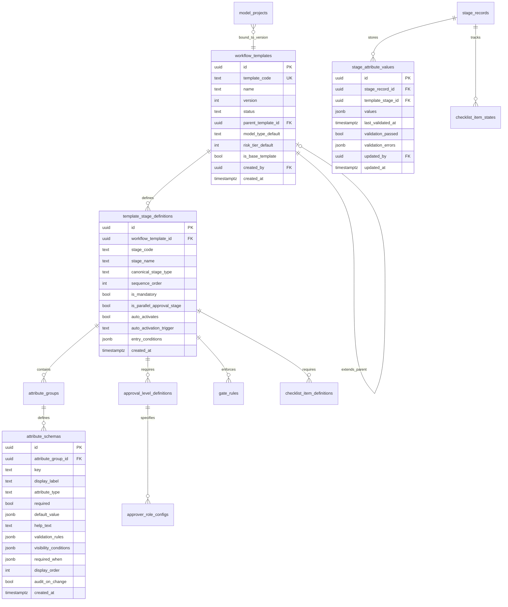

# Configurable Workflow Engine (CWE)
## Addendum to MLM Platform Documentation

**Document ID:** MLM-CWE-001  
**Version:** 1.0  
**Status:** Draft  
**Classification:** Internal — Confidential  
**Type:** Addendum — supersedes sections in FRD, SRD, and DMD  

**Supersedes:**
- `MLM-FRD-001` Section 17 — Workflow Engine Requirements (partially)
- `MLM-SRD-001` Section 4.3 — Workflow Engine Component (partially)
- `MLM-DMD-001` Section 4 — Schema: mlm_workflow (partially)

**Related Documents:**
- `MLM-FRD-001` — Functional Requirements Document
- `MLM-SRD-001` — System Requirements Document
- `MLM-DMD-001` — Data Model Document
- `MLM-UX-001` — UI/UX Specification

---

## Document Control

| Version | Date | Author | Change Description |
|---------|------|--------|-------------------|
| 1.0 | 2024-Q4 | Architecture Team | Initial release |

### Review & Approval

| Role | Name | Status |
|------|------|--------|
| Enterprise Architect | TBD | Pending |
| Product Owner | TBD | Pending |
| Lead Engineer | TBD | Pending |

---

## Table of Contents

1. [Motivation & Scope](#1-motivation--scope)
2. [Design Philosophy](#2-design-philosophy)
3. [Core Concepts](#3-core-concepts)
4. [Base Workflow Templates](#4-base-workflow-templates)
5. [Template Architecture](#5-template-architecture)
6. [Attribute Schema System](#6-attribute-schema-system)
7. [Approval Configuration System](#7-approval-configuration-system)
8. [Data Model — New & Updated Tables](#8-data-model--new--updated-tables)
9. [Runtime Behavior](#9-runtime-behavior)
10. [Template Management](#10-template-management)
11. [Admin UI — Template Builder](#11-admin-ui--template-builder)
12. [Migration from Fixed Workflow](#12-migration-from-fixed-workflow)
13. [Supersession Index](#13-supersession-index)

---

## 1. Motivation & Scope

### 1.1 Problem Statement

The original MLM design assumed a fixed 7-stage lifecycle applicable to all model types. In practice, organizations manage fundamentally different types of AI/ML assets — each with distinct governance needs, stage structures, required attributes, and approval chains:

| Model Type | Governance Profile |
|------------|-------------------|
| **Internal ML Model** | Full 7-stage lifecycle; independent validation; SR 11-7 compliance |
| **GenAI / LLM Model** | Prompt engineering stage; safety evaluation; guardrail config; HITL design; hallucination testing — no traditional "training" validation |
| **Fine-Tuned Model** | Base model selection stage; hybrid of internal + GenAI governance |
| **Vendor / 3rd Party** | No development or validation; due diligence + risk assessment + periodic review only |
| **Embedded Vendor GenAI** | Vendor registration + GenAI risk assessment; lighter than internal GenAI |
| **RAG System** | Knowledge base governance + retrieval evaluation stages |
| **Agentic System** | Agent safety testing + tool authorization stages |
| **Regulatory Score** | Vendor registration + regulatory mapping only (e.g., FICO score) |

A single fixed workflow cannot serve all these types without either over-burdening simple cases or under-governing complex ones.

### 1.2 What This Addendum Defines

- A **Workflow Template** system allowing admins to define custom lifecycle stage sequences per model type
- A **Configurable Attribute Schema** system allowing admins to define stage-specific data fields without code changes
- A **Configurable Approval System** allowing admins to set approval roles, levels, and SLAs per stage per template
- **Four base templates** shipped with the platform covering the most common model types
- **Template versioning and freezing** ensuring in-progress projects are never affected by template changes
- **Admin UI** for building, cloning, and managing templates

### 1.3 What This Addendum Does NOT Change

- The DES (Deployment Eligibility Service) — eligibility logic remains governance-driven, not template-driven
- The audit log design — all actions are logged regardless of template
- The model registry design — `model_projects` and `model_versions` remain the core entities
- The SM↔MLM registry sync design
- The storage architecture

---

## 2. Design Philosophy

### 2.1 Structured Flexibility

The system must be flexible enough to accommodate diverse model types while retaining enough structure to enforce governance. The design principle is:

```
Fixed:        What must always be true
              (audit trail, immutability, approval attribution,
               DES eligibility check, SR 11-7 inventory inclusion)

Configurable: How governance is expressed
              (which stages, in what order, what data is captured,
               who approves, what SLAs apply)
```

### 2.2 Attribute Schema Approach

Stage-specific attributes use a **JSON Schema-validated JSONB** approach rather than EAV (Entity-Attribute-Value) or per-type extension tables:

```
Admin defines: attribute schemas (name, type, validation rules)
               → stored in mlm_workflow.attribute_schemas

Runtime:       attribute values validated against schema on save
               → stored as JSONB in mlm_core.stage_attribute_values

Querying:      JSONB path queries for reporting
               OpenSearch indexes for search
```

This gives flexibility without sacrificing type safety or queryability.

### 2.3 Template Versioning Contract

Templates are versioned and projects are frozen to the template version active at project creation:

```
Template v1  ──► Projects A, B, C  (frozen to v1 forever)
Template v2  ──► Projects D, E, F  (frozen to v2 forever)
Template v3  ──► Projects G, H, I  (new projects only)
```

This is non-negotiable for SR 11-7 compliance — governance requirements cannot change mid-project without documented justification.

---

## 3. Core Concepts

### 3.1 Concept Hierarchy

```
WORKFLOW TEMPLATE
  └── STAGE DEFINITIONS  (ordered list of stages)
        └── ATTRIBUTE GROUPS  (logical groupings of fields)
              └── ATTRIBUTE SCHEMAS  (individual field definitions)
        └── APPROVAL CONFIGURATION  (who approves, how many levels)
              └── APPROVAL LEVEL DEFINITIONS  (sequential or parallel)
                    └── APPROVER ROLE DEFINITIONS
        └── GATE RULES  (entry criteria, exit criteria)
        └── CHECKLIST ITEMS  (required artifacts/tasks for gate)
```

### 3.2 Concept Definitions

**Workflow Template:** A named, versioned configuration defining the complete lifecycle for a model type. Contains an ordered list of stage definitions.

**Stage Definition:** A named stage within a template. May map to a canonical stage type (INCEPTION, DEVELOPMENT, etc.) or be a custom stage (PROMPT_ENGINEERING, DUE_DILIGENCE, SAFETY_EVALUATION).

**Attribute Group:** A logical grouping of attribute schemas within a stage (e.g., "Model Information", "Data Sources", "Risk Profile"). Displayed as sections in the UI form.

**Attribute Schema:** A single field definition — name, display label, type, required flag, validation rules, help text, conditional visibility rules.

**Approval Level:** A sequential approval step within a stage gate. Multiple levels are processed in order (Level 1 must complete before Level 2). Within a level, multiple approver roles may be configured as parallel (all must approve) or quorum (N of M must approve).

**Gate Rule:** A condition evaluated at stage entry (entry criteria) or before gate submission (exit criteria). Rules may check: checklist completion, required attributes populated, findings count, specific approval received.

**Checklist Item:** A required artifact upload or task completion that must be satisfied before the stage gate can be submitted.

---

## 4. Base Workflow Templates

The platform ships with four base templates. Admins cannot modify base templates directly — they clone them to create custom templates.

### 4.1 Base Template 1: Internal ML Model

**Template ID:** `BASE-INTERNAL-ML-V1`  
**Applicable to:** Internally developed supervised/unsupervised ML models  
**Risk tiers:** All (1–4, with tier-conditional approval levels)

```
Stage 1: Inception
  Purpose: Capture business case, risk profile, data landscape
  Canonical type: INCEPTION
  Required attributes: Project charter, use case, risk inputs,
                       regulatory scope, data classification,
                       stakeholder registry, cost center
  Approval levels:
    Level 1: Model Owner (1 required)
    Level 2 (Tier 1–2 only): Risk Officer (1 required)
  SLA: 72 hours

Stage 2: Development
  Purpose: Model training, experimentation, candidate selection
  Canonical type: DEVELOPMENT
  Required attributes: Development plan, data lineage,
                       code repo link, MLflow/platform integration,
                       candidate model selection, performance benchmarks
  Conditional attributes (Tier 1–2): Bias & fairness assessment draft
  Approval levels:
    Level 1: Model Owner (1 required)
  SLA: 48 hours

Stage 3: Validation
  Purpose: Independent validation by non-development team
  Canonical type: VALIDATION
  Required attributes: Test plan completion, test results per category,
                       findings with remediation, validation report
  Approval levels:
    Level 1: Lead Validator (1 required)
    Level 2 (Tier 1): Risk Officer (1 required, countersignature)
  Conflict rule: Validators cannot have participated in Development
  SLA: 120 hours (5 days)

Stage 4: Implementation
  Purpose: Controlled deployment to production
  Canonical type: IMPLEMENTATION
  Required attributes: Deployment plan, infrastructure config,
                       smoke test results, integration test results,
                       rollback procedure, runbook
  Approval levels:
    Level 1 (parallel): ML Engineer AND Model Owner (both required)
  SLA: 48 hours

Stage 5: Monitoring
  Purpose: Ongoing post-deployment monitoring
  Canonical type: MONITORING
  Required attributes: Monitor configurations (at least 1 active),
                       baseline statistics, alert thresholds
  Approval levels: N/A (monitoring is continuous, not gated)
  Notes: Stage activates automatically on deployment confirmation

Stage 6: Versioning
  Purpose: Track model versions
  Canonical type: VERSIONING
  Notes: Managed by system; no explicit gate

Stage 7: Retirement
  Purpose: Controlled decommissioning
  Canonical type: RETIREMENT
  Required attributes: Retirement plan, reason, consumer notification,
                       successor model reference (if applicable)
  Approval levels:
    Level 1: Model Owner (1 required)
  SLA: 24 hours (decommission gate, after transition period)
```

---

### 4.2 Base Template 2: GenAI / LLM Model

**Template ID:** `BASE-GENAI-LLM-V1`  
**Applicable to:** Foundation model APIs, fine-tuned LLMs, RAG systems, agentic systems  
**Risk tiers:** Typically Tier 1–2 (AUTONOMOUS use cases auto-escalate to Tier 1)

```
Stage 1: Inception
  Purpose: GenAI use case definition, risk classification, 
           foundation model selection, HITL design
  Canonical type: INCEPTION
  Required attributes: All Internal ML inception attributes PLUS:
    - GenAI subtype (FOUNDATION_API, FINE_TUNED, RAG, AGENTIC, SLM)
    - Autonomy level (ASSISTIVE, AUGMENTATIVE, AUTONOMOUS)
    - Output type (INFORMATIONAL through PROCESS_AUTOMATION)
    - Foundation model provider + model name + version
    - DPA reference + data residency confirmation
    - Human-in-the-loop design
    - Prohibited use declaration
  Approval levels:
    Level 1: Model Owner (1 required)
    Level 2: Risk Officer (1 required — mandatory for all GenAI Tier 1)
  SLA: 72 hours

Stage 2: Prompt Engineering & Configuration
  Purpose: System prompt development, RAG configuration,
           agent workflow definition, guardrail setup
  Canonical type: CUSTOM (maps to DEVELOPMENT for lineage)
  Required attributes:
    - Prompt Registry: initial system prompt version
    - Prompt evaluation dataset (reference)
    - For RAG: vector store type, embedding model, 
               chunking strategy, knowledge base URI
    - For Agentic: tool list, memory design, max execution depth
    - Guardrail configuration (platform + settings)
    - LLM observability platform configuration
  Approval levels:
    Level 1: Model Owner (1 required)
  SLA: 48 hours

Stage 3: Safety Evaluation
  Purpose: Structured safety, fairness, and quality testing
           by independent evaluators
  Canonical type: CUSTOM (maps to VALIDATION for lineage)
  Required attributes:
    - Hallucination rate test results + threshold evidence
    - Toxicity test results
    - Prompt injection resistance test results
    - Bias & fairness evaluation (for DECISION_SUPPORT / DECISION_MAKING)
    - PII leakage test results
    - Groundedness test results (RAG only)
    - Consistency testing results
    - Agentic safety test results (AGENTIC only)
    - Red team exercise report (AUTONOMOUS only — mandatory)
    - GenAI Model Card (completed)
    - Responsible AI Assessment (NIST AI RMF alignment)
  Approval levels:
    Level 1: Lead Safety Evaluator (1 required)
    Level 2 (AUTONOMOUS models): Risk Officer (1 required)
    Level 3 (EU-regulated): Compliance Manager (1 required)
  Conflict rule: Safety Evaluator cannot have created prompts in Stage 2
  SLA: 168 hours (7 days — red team exercises take time)

Stage 4: Guardrail & Implementation
  Purpose: Production deployment with guardrail lock
  Canonical type: IMPLEMENTATION
  Required attributes:
    - Prompt version locked for deployment (from prompt registry)
    - Guardrail configuration ID confirmed active
    - Rate limit / token quota configuration
    - LLM observability integration active
    - Cost monitoring configuration (budget alerts)
    - A/B test configuration (if applicable)
  Special rule: Prompt version deployed is locked at this stage.
               Future prompt changes require Minor Version increment.
  Approval levels:
    Level 1 (parallel): ML Engineer AND Model Owner (both required)
  SLA: 48 hours

Stage 5: LLM Monitoring
  Purpose: Ongoing quality, safety, cost, and drift monitoring
  Canonical type: MONITORING
  Required attributes:
    - Hallucination rate monitor active
    - Toxicity monitor active
    - Token cost budget configured
    - User feedback capture configured
    - Knowledge base staleness monitor (RAG only)
    - Production sampling rate configured (default 5%)
  Approval levels: N/A (continuous)

Stage 6: Versioning
  Canonical type: VERSIONING
  Notes: Prompt version changes trigger PATCH version.
         Base model provider deprecation triggers review task.

Stage 7: Retirement
  Canonical type: RETIREMENT
  Additional attributes (RAG): Knowledge base decommission checklist
  Additional attributes (Agentic): Agent capability impact assessment
```

---

### 4.3 Base Template 3: Vendor / 3rd Party Model

**Template ID:** `BASE-VENDOR-V1`  
**Applicable to:** Embedded vendor models, API-delivered models, regulatory scores  
**Risk tiers:** Auto-assigned Tier 3 unless escalated by Risk Officer

```
Stage 1: Vendor Registration
  Purpose: Inventory the vendor model with full metadata
  Canonical type: INCEPTION
  Required attributes:
    - Vendor / provider name
    - Product / tool name and version
    - Model capability description
    - Data inputs (what org data is processed)
    - Output / decision influenced
    - Business use case
    - Usage scope (teams / processes)
    - Hosting location (vendor cloud / on-premise / embedded)
    - Data residency (where org data is sent)
    - Contractual reference (MSA, license)
    - Risk classification (Tier; defaults to 3)
    - Regulatory applicability
  Approval levels:
    Level 1: Model Owner (1 required)
    Level 2 (Tier 1–2): Risk Officer (1 required)
  SLA: 48 hours

Stage 2: Due Diligence
  Purpose: Collect and review vendor-provided documentation
  Canonical type: CUSTOM
  Required attributes:
    - Vendor SOC 2 / ISO 27001 report (attach or note N/A)
    - Model methodology documentation (attach or note not available)
    - Vendor accuracy / performance claims (attach or note)
    - Bias assessment (vendor-provided or note not available)
    - Opt-out from vendor model training (confirmed Y/N + contract ref)
  Optional attributes:
    - Independent benchmark results
    - Shadow test results
  Approval levels:
    Level 1: Model Owner (1 required)
    Level 2 (Tier 1–2): Risk Officer (1 required)
  SLA: 72 hours

Stage 3: Risk Assessment
  Purpose: Structured risk assessment for Tier 1–2 vendor models
  Canonical type: CUSTOM
  Conditional: Required for Tier 1–2; optional for Tier 3–4
  Required attributes (when active):
    - Known model limitations documented
    - Compensating controls in place
    - Exit / replacement plan documented
    - Escalation triggers defined
    - Usage volume estimate
  Approval levels:
    Level 1: Risk Officer (1 required — mandatory)
  SLA: 96 hours

Stage 4: Activation
  Purpose: Confirm model is active in production use
  Canonical type: IMPLEMENTATION (lightweight)
  Required attributes:
    - Confirmation of active use (date, scope)
    - Consumer systems / teams list
    - Usage volume tracking method
  Approval levels:
    Level 1: Model Owner (1 required)
  SLA: 24 hours

Stage 5: Periodic Review
  Purpose: Scheduled recurring governance review
  Canonical type: MONITORING (recurring)
  Required attributes (per review cycle):
    - Review date
    - Current status assessment
    - Vendor change notifications since last review
    - Updated due diligence documents (if changed)
    - Usage volume actuals
    - Incident log review
  Notes: Triggered automatically on review_due_date.
         Review cycle configurable (default: annual for Tier 3,
         semi-annual for Tier 1–2).
  Approval levels:
    Level 1: Model Owner (1 required)
    Level 2 (Tier 1–2): Risk Officer (1 required)
  SLA: 48 hours

Stage 6: Decommission
  Purpose: Controlled retirement of vendor model usage
  Canonical type: RETIREMENT
  Required attributes:
    - Reason for decommission
    - End-of-use date
    - Successor solution (if applicable)
    - Affected use cases
    - Consumer notification confirmation
  Approval levels:
    Level 1: Model Owner (1 required)
  SLA: 24 hours
```

---

### 4.4 Base Template 4: Fine-Tuned Model

**Template ID:** `BASE-FINE-TUNED-V1`  
**Applicable to:** Foundation models fine-tuned on organizational data  
**Risk tiers:** Typically Tier 1–2 (inherits base model risk + training data risk)

```
Stage 1: Inception
  Purpose: Use case definition + base model selection rationale
  Canonical type: INCEPTION
  Required attributes: All Internal ML inception attributes PLUS:
    - Base model selection (provider, model, version, rationale)
    - Fine-tuning methodology (LoRA, QLoRA, full fine-tune)
    - Training data source and PII assessment
    - Base model license compliance confirmation
    - Inherited risk from base model documented
  Approval levels:
    Level 1: Model Owner (1 required)
    Level 2: Risk Officer (1 required — mandatory, base model risk)
  SLA: 72 hours

Stage 2: Base Model Assessment
  Purpose: Evaluate base model capabilities and limitations
           before fine-tuning commitment
  Canonical type: CUSTOM
  Required attributes:
    - Base model capability evaluation results
    - Base model safety evaluation (hallucination, bias, toxicity)
    - Base model license terms reviewed
    - Data Processing Agreement with base model provider confirmed
    - Base model version locked (provider deprecation risk noted)
  Approval levels:
    Level 1: Lead Evaluator (1 required)
  SLA: 48 hours

Stage 3: Fine-Tuning Development
  Purpose: Fine-tuning execution and experiment tracking
  Canonical type: DEVELOPMENT
  Required attributes: All Internal ML development attributes PLUS:
    - Fine-tuning dataset reference + PII assessment
    - PEFT configuration (adapter type, rank, target modules)
    - Training infrastructure specification
    - Candidate fine-tuned model selection
    - Catastrophic forgetting assessment
    - Base model vs fine-tuned capability comparison
  Approval levels:
    Level 1: Model Owner (1 required)
  SLA: 48 hours

Stage 4: Safety & Quality Validation
  Purpose: Combined technical validation + safety evaluation
           (merges Internal ML validation + GenAI safety evaluation)
  Canonical type: VALIDATION
  Required attributes: All Internal ML validation attributes PLUS:
    - Hallucination rate vs base model comparison
    - Fine-tuning data leakage test (PII extraction attempts)
    - Toxicity regression test (vs base model)
    - Task-specific accuracy on evaluation dataset
    - Safety alignment evaluation (RLHF/DPO effectiveness)
    - GenAI Model Card (completed)
  Approval levels:
    Level 1: Lead Validator (1 required)
    Level 2: Risk Officer (1 required)
  SLA: 120 hours

Stage 5: Implementation
  Canonical type: IMPLEMENTATION
  Additional attributes: Serving framework, quantization level,
                         hardware configuration, prompt version locked
  Approval levels:
    Level 1 (parallel): ML Engineer AND Model Owner (both required)
  SLA: 48 hours

Stage 6: Monitoring
  Canonical type: MONITORING
  Includes both traditional drift monitoring (Stage 5 Internal ML)
  and LLM quality monitoring (Stage 5 GenAI/LLM)

Stage 7: Versioning
  Notes: Base model version change triggers Major Version increment
         and full re-validation cycle

Stage 8: Retirement
  Canonical type: RETIREMENT
```

---

## 5. Template Architecture

### 5.1 Template Lifecycle

```
BASE TEMPLATE (system-owned, read-only)
      │
      │  Clone
      ▼
CUSTOM TEMPLATE (admin-owned)
  ├── DRAFT      — being configured, not yet usable
  ├── ACTIVE     — available for new project creation
  ├── DEPRECATED — no new projects; existing projects unaffected
  └── ARCHIVED   — hidden from UI; existing projects unaffected

NEW PROJECT CREATION:
  Admin selects template → system snapshots the template version
  → project is bound to that snapshot forever
  → template changes after this point have zero effect on the project
```

### 5.2 Template Inheritance

Custom templates may extend a base template (one level only):

```
BASE-INTERNAL-ML-V1
      │
      │  extends
      ▼
CUSTOM: Financial Services ML Model
  Inherits: All stages from BASE-INTERNAL-ML-V1
  Adds:     Stage 3.5 — Model Risk Committee Review (custom stage)
  Overrides: Stage 3 Approval Level 2 → Chief Risk Officer role
  Adds attributes: Stage 1 → FINRA regulatory scope field
```

Inheritance rules:
- Inherited stages cannot be removed (only extended)
- Approval levels may be added or made more restrictive (more approvers)
- Approval levels may NOT be made less restrictive (fewer approvers) in an extension
- New stages may be inserted between inherited stages
- Attribute schemas may be extended with additional fields

### 5.3 Stage Ordering

Stages within a template are **linearly ordered** with sequential execution. Parallel execution within a stage is handled at the approval level (parallel approver roles), not at the stage level.

```
Stage sequence: [1] [2] [3] ... [N]

Rules:
- Each stage must complete (reach COMPLETED or APPROVED status)
  before the next stage activates
- Exception: MONITORING activates automatically on production
  deployment (does not require explicit activation)
- Exception: VERSIONING is a passive stage (no gate, system-managed)
- Stages marked optional may be skipped with documented justification
  + approval from Risk Officer
```

---

## 6. Attribute Schema System

### 6.1 Supported Attribute Types

| Type | Description | Validation Options | Storage |
|------|-------------|-------------------|---------|
| `TEXT` | Single-line text | min/max length, regex pattern | JSON string |
| `RICH_TEXT` | Multi-line formatted text | max length | JSON string |
| `NUMBER_INT` | Integer | min, max | JSON number |
| `NUMBER_DECIMAL` | Decimal number | min, max, decimal_places | JSON number |
| `BOOLEAN` | Yes/No toggle | — | JSON boolean |
| `DATE` | Date only | min_date, max_date, relative constraints | JSON ISO date string |
| `DATETIME` | Date + time | — | JSON ISO datetime string |
| `SINGLE_SELECT` | One value from a list | options list (configurable) | JSON string |
| `MULTI_SELECT` | Multiple values from a list | options list, min/max selections | JSON array |
| `URL` | Web URL | must be valid URL | JSON string |
| `EMAIL` | Email address | must be valid email | JSON string |
| `USER_REFERENCE` | Link to MLM user | must exist in mlm_users | JSON UUID |
| `FILE_REFERENCE` | Link to uploaded artifact | must exist in stage_artifacts | JSON UUID |
| `JSON_OBJECT` | Structured JSON | JSON Schema validation | JSON object |
| `RATING` | Numeric rating | min, max, step | JSON number |
| `COMPUTED` | Read-only computed value | formula expression | JSON any |

### 6.2 Attribute Schema Definition

Each attribute schema defines a single field within a stage for a template:

```json
{
  "id": "attr-schema-uuid",
  "template_stage_id": "stage-def-uuid",
  "attribute_group_id": "group-uuid",
  "key": "hallucination_rate_threshold",
  "display_label": "Maximum Acceptable Hallucination Rate",
  "type": "NUMBER_DECIMAL",
  "required": true,
  "default_value": 0.02,
  "help_text": "Percentage of outputs containing unsupported factual claims. Recommended: <2% for decision-support, <0.5% for decision-making.",
  "placeholder": "e.g., 0.02",
  "validation_rules": {
    "min": 0.0,
    "max": 1.0,
    "decimal_places": 4
  },
  "visibility_conditions": [
    {
      "when_attribute": "output_type",
      "operator": "in",
      "value": ["DECISION_SUPPORT", "DECISION_MAKING"]
    }
  ],
  "display_order": 5,
  "section": "Safety Thresholds",
  "tags": ["genai", "safety", "required_tier_1"],
  "audit_on_change": true
}
```

### 6.3 Visibility Conditions

Attributes may be conditionally shown or hidden based on values of other attributes in the same stage or project-level properties:

```json
"visibility_conditions": [
  {
    "logic": "AND",
    "conditions": [
      {
        "when_attribute": "genai_subtype",
        "operator": "equals",
        "value": "RAG"
      },
      {
        "when_attribute": "project.risk_tier",
        "operator": "in",
        "value": [1, 2]
      }
    ]
  }
]
```

Supported operators: `equals`, `not_equals`, `in`, `not_in`, `greater_than`, `less_than`, `is_set`, `is_not_set`

Attribute sources: `self` (same stage), `project` (project-level properties), `previous_stage` (values from a named prior stage)

### 6.4 Conditional Required Rules

An attribute can be conditionally required based on other values:

```json
"required": false,
"required_when": {
  "when_attribute": "project.risk_tier",
  "operator": "in",
  "value": [1, 2]
}
```

### 6.5 Attribute Groups

Attributes are organized into named groups that render as collapsible sections in the UI form:

```json
{
  "id": "group-uuid",
  "template_stage_id": "stage-def-uuid",
  "name": "Safety Thresholds",
  "display_label": "Safety Thresholds",
  "description": "Define acceptable limits for safety metrics",
  "display_order": 3,
  "is_collapsible": true,
  "collapsed_by_default": false,
  "visibility_conditions": []
}
```

---

## 7. Approval Configuration System

### 7.1 Approval Level Design

Each stage gate has one or more **approval levels** processed sequentially:

```
Gate for Stage 3 (Validation) — Tier 1 model:

Level 1 (Sequential first):
  Type: SINGLE_APPROVER
  Role: MODEL_VALIDATOR (Lead Validator)
  Required: 1 of eligible users
  Must complete before Level 2 activates

Level 2 (Activates after Level 1 approved):
  Type: QUORUM
  Roles: [RISK_OFFICER]
  Required: 1 of 1
  SLA: 48 hours

Gate is APPROVED when all levels are approved.
Gate is REJECTED if any level is rejected.
```

### 7.2 Approval Level Types

| Type | Description | Configuration |
|------|-------------|--------------|
| `SINGLE_APPROVER` | Exactly one approver from the role | `role`, `min_approvers: 1` |
| `ALL_OF_ROLE` | All assigned users with the role must approve | `role`, `min_approvers: all` |
| `QUORUM` | N of M users with the role must approve | `role`, `min_approvers: N` |
| `PARALLEL_ROLES` | Multiple roles must ALL approve (simultaneously) | `roles: []`, each role: `min_approvers: 1` |
| `ANY_OF_ROLES` | Any one of multiple roles may approve | `roles: []`, total `min_approvers: 1` |
| `CONDITIONAL` | Approval level only activates if a condition is met | `activation_condition`, + level config |

### 7.3 Approval Level Configuration Schema

```json
{
  "id": "approval-level-uuid",
  "template_stage_id": "stage-def-uuid",
  "level_number": 2,
  "level_name": "Risk Officer Countersignature",
  "type": "SINGLE_APPROVER",
  "roles": ["RISK_OFFICER"],
  "min_approvers": 1,
  "sla_hours": 48,
  "escalation_role": "ADMIN",
  "escalation_after_hours": 40,
  "allow_delegation": true,
  "max_delegation_hours": 48,
  "conflict_of_interest_check": false,
  "self_approval_allowed": false,
  "activation_condition": {
    "type": "TIER_FILTER",
    "risk_tiers": [1, 2]
  },
  "parallel_with_level": null,
  "notification_template": "approval_request_risk_officer",
  "inline_approval_enabled": true
}
```

### 7.4 Conditional Activation Conditions

Approval levels may be conditionally activated based on model or stage properties:

| Condition Type | Description | Example |
|----------------|-------------|---------|
| `TIER_FILTER` | Only for specified risk tiers | Tier 1–2 only |
| `MODEL_TYPE_FILTER` | Only for specified model types | AUTONOMOUS GenAI only |
| `ATTRIBUTE_VALUE` | When a stage attribute has a specific value | Red team required = true |
| `FINDING_SEVERITY` | When unresolved findings of severity exist | Any CRITICAL findings |
| `ALWAYS` | Unconditional (default) | — |
| `NEVER` | Disabled (used to override in child template) | — |

### 7.5 Special Approval Rules

**Conflict of Interest Enforcement:**
```json
"conflict_of_interest_rules": [
  {
    "rule_type": "EXCLUDE_CONTRIBUTORS",
    "exclude_from_stage": "DEVELOPMENT",
    "applies_to_levels": [1],
    "error_message": "Validators cannot have contributed to Development stage"
  }
]
```

**Self-Approval Prohibition:**
When `self_approval_allowed: false`, the user who submitted the stage for gate review cannot be the sole approver. If no eligible approver exists, the system escalates to Admin.

**Quorum Calculation:**
For `QUORUM` type, `min_approvers` may be a fixed integer (e.g., 2) or a percentage expression (e.g., `"50%+1"` of eligible users).

---

## 8. Data Model — New & Updated Tables

### 8.1 Entity Relationship Diagram



---

### 8.2 Table: `mlm_workflow.workflow_templates`

| Column | Type | Nullable | Constraints | Description |
|--------|------|----------|-------------|-------------|
| `id` | UUID | NOT NULL | PK | — |
| `template_code` | TEXT | NOT NULL | UNIQUE | Machine identifier: `BASE-INTERNAL-ML-V1`, `CUSTOM-FINSERV-ML-V2` |
| `name` | TEXT | NOT NULL | LENGTH 3–100 | Human display name |
| `description` | TEXT | NULL | — | Template purpose and applicable model types |
| `version` | INTEGER | NOT NULL | DEFAULT 1, CHECK > 0 | Monotonically increasing version per template_code |
| `status` | mlm_workflow_template_status_enum | NOT NULL | DEFAULT 'DRAFT' | `DRAFT`, `ACTIVE`, `DEPRECATED`, `ARCHIVED` |
| `is_base_template` | BOOLEAN | NOT NULL | DEFAULT FALSE | System-owned base templates; cannot be modified |
| `parent_template_id` | UUID | NULL | FK → workflow_templates (self) | Parent template being extended |
| `model_type_default` | mlm_core_model_type_enum | NULL | — | Default model type this template applies to |
| `risk_tier_applicability` | INTEGER[] | NULL | — | Which risk tiers this template is recommended for |
| `tags` | TEXT[] | NOT NULL | DEFAULT '{}' | Searchable tags |
| `cloned_from_id` | UUID | NULL | FK → workflow_templates (self) | Source template if cloned |
| `change_summary` | TEXT | NULL | — | What changed in this version vs prior |
| `active_projects_count` | INTEGER | NOT NULL | DEFAULT 0 | Denormalized count of active projects using this template |
| `created_by` | UUID | NOT NULL | FK → mlm_users.users | — |
| `approved_by` | UUID | NULL | FK → mlm_users.users | Admin who approved template for use |
| `approved_at` | TIMESTAMPTZ | NULL | — | — |
| `created_at` | TIMESTAMPTZ | NOT NULL | DEFAULT NOW() | — |
| `updated_at` | TIMESTAMPTZ | NOT NULL | DEFAULT NOW() | — |

**Key Constraints:**
```sql
-- Only one ACTIVE version per template_code
CREATE UNIQUE INDEX uq_workflow_templates_active
  ON mlm_workflow.workflow_templates (template_code)
  WHERE status = 'ACTIVE';

-- Base templates cannot be modified (enforced by trigger)
-- is_base_template = TRUE → only INSERT allowed, no UPDATE
```

---

### 8.3 Table: `mlm_workflow.template_stage_definitions`

| Column | Type | Nullable | Constraints | Description |
|--------|------|----------|-------------|-------------|
| `id` | UUID | NOT NULL | PK | — |
| `workflow_template_id` | UUID | NOT NULL | FK → workflow_templates | Parent template |
| `stage_code` | TEXT | NOT NULL | — | Unique within template: `INCEPTION`, `PROMPT_ENGINEERING`, `DUE_DILIGENCE` |
| `stage_name` | TEXT | NOT NULL | — | Display name |
| `stage_description` | TEXT | NULL | — | Purpose description |
| `canonical_stage_type` | mlm_core_stage_type_enum | NOT NULL | — | Maps custom stages to canonical type for lineage + DES |
| `sequence_order` | INTEGER | NOT NULL | CHECK > 0 | Position in lifecycle (1-based) |
| `is_mandatory` | BOOLEAN | NOT NULL | DEFAULT TRUE | Optional stages may be skipped |
| `skip_requires_justification` | BOOLEAN | NOT NULL | DEFAULT TRUE | If skippable, requires documented reason |
| `skip_approval_role` | TEXT | NULL | — | Role required to approve skipping |
| `auto_activates` | BOOLEAN | NOT NULL | DEFAULT FALSE | Activates without explicit trigger |
| `auto_activation_trigger` | TEXT | NULL | — | `ON_PREVIOUS_STAGE_COMPLETE`, `ON_DEPLOYMENT_CONFIRMED`, `ON_SCHEDULE` |
| `has_gate` | BOOLEAN | NOT NULL | DEFAULT TRUE | Whether stage has an approval gate |
| `gate_name` | TEXT | NULL | — | e.g., `Production Promotion Gate` |
| `is_recurring` | BOOLEAN | NOT NULL | DEFAULT FALSE | For periodic review stages |
| `recurrence_config` | JSONB | NULL | — | `{frequency_months: 12, owner_field: "review_owner_id"}` |
| `entry_conditions` | JSONB | NULL | — | Rules evaluated before stage can be entered |
| `exit_conditions` | JSONB | NULL | — | Rules evaluated before gate can be submitted |
| `inherited_from_stage_id` | UUID | NULL | FK → template_stage_definitions (self) | If stage inherited from parent template |
| `is_override` | BOOLEAN | NOT NULL | DEFAULT FALSE | TRUE if overriding inherited stage |
| `ui_icon` | TEXT | NULL | — | Icon name for UI display |
| `ui_color` | TEXT | NULL | — | Stage node color for lifecycle map |
| `created_at` | TIMESTAMPTZ | NOT NULL | DEFAULT NOW() | — |

**Key Constraint:**
```sql
CREATE UNIQUE INDEX uq_template_stage_code
  ON mlm_workflow.template_stage_definitions (workflow_template_id, stage_code);

CREATE UNIQUE INDEX uq_template_stage_order
  ON mlm_workflow.template_stage_definitions (workflow_template_id, sequence_order);
```

---

### 8.4 Table: `mlm_workflow.attribute_groups`

| Column | Type | Nullable | Constraints | Description |
|--------|------|----------|-------------|-------------|
| `id` | UUID | NOT NULL | PK | — |
| `template_stage_id` | UUID | NOT NULL | FK → template_stage_definitions | Parent stage |
| `name` | TEXT | NOT NULL | — | Group key (machine): `safety_thresholds` |
| `display_label` | TEXT | NOT NULL | — | UI section header |
| `description` | TEXT | NULL | — | Section helper text |
| `display_order` | INTEGER | NOT NULL | DEFAULT 1 | Render order on form |
| `is_collapsible` | BOOLEAN | NOT NULL | DEFAULT FALSE | Can user collapse this section |
| `collapsed_by_default` | BOOLEAN | NOT NULL | DEFAULT FALSE | Starts collapsed |
| `visibility_conditions` | JSONB | NULL | — | Conditional group visibility |
| `created_at` | TIMESTAMPTZ | NOT NULL | DEFAULT NOW() | — |

---

### 8.5 Table: `mlm_workflow.attribute_schemas`

| Column | Type | Nullable | Constraints | Description |
|--------|------|----------|-------------|-------------|
| `id` | UUID | NOT NULL | PK | — |
| `attribute_group_id` | UUID | NOT NULL | FK → attribute_groups | Parent group |
| `template_stage_id` | UUID | NOT NULL | FK → template_stage_definitions | Denormalized for fast lookup |
| `key` | TEXT | NOT NULL | — | Machine key: `hallucination_rate_threshold` |
| `display_label` | TEXT | NOT NULL | — | UI field label |
| `attribute_type` | mlm_workflow_attribute_type_enum | NOT NULL | — | See Section 6.1 |
| `required` | BOOLEAN | NOT NULL | DEFAULT FALSE | Unconditionally required |
| `required_when` | JSONB | NULL | — | Conditional required rule |
| `default_value` | JSONB | NULL | — | Type-appropriate default |
| `placeholder` | TEXT | NULL | — | Input placeholder text |
| `help_text` | TEXT | NULL | — | Tooltip / description |
| `validation_rules` | JSONB | NULL | — | Type-specific validation: min, max, pattern, options |
| `visibility_conditions` | JSONB | NULL | — | Conditional show/hide |
| `display_order` | INTEGER | NOT NULL | DEFAULT 1 | Render order within group |
| `is_searchable` | BOOLEAN | NOT NULL | DEFAULT FALSE | Index in OpenSearch |
| `is_reportable` | BOOLEAN | NOT NULL | DEFAULT FALSE | Include in compliance reports |
| `audit_on_change` | BOOLEAN | NOT NULL | DEFAULT TRUE | Log changes to audit trail |
| `inherited_from_id` | UUID | NULL | FK → attribute_schemas (self) | Source if inherited |
| `is_override` | BOOLEAN | NOT NULL | DEFAULT FALSE | TRUE if overriding inherited attribute |
| `created_at` | TIMESTAMPTZ | NOT NULL | DEFAULT NOW() | — |

**Key Constraint:**
```sql
CREATE UNIQUE INDEX uq_attribute_schema_key
  ON mlm_workflow.attribute_schemas (template_stage_id, key);
```

---

### 8.6 Table: `mlm_workflow.approval_level_definitions`

| Column | Type | Nullable | Constraints | Description |
|--------|------|----------|-------------|-------------|
| `id` | UUID | NOT NULL | PK | — |
| `template_stage_id` | UUID | NOT NULL | FK → template_stage_definitions | Parent stage |
| `level_number` | INTEGER | NOT NULL | CHECK > 0 | Sequential order |
| `level_name` | TEXT | NOT NULL | — | e.g., `Risk Officer Countersignature` |
| `level_type` | mlm_workflow_approval_type_enum | NOT NULL | — | See Section 7.2 |
| `sla_hours` | INTEGER | NOT NULL | DEFAULT 48 | Approval SLA |
| `escalation_role` | TEXT | NULL | — | Role notified on SLA breach |
| `escalation_after_hours` | INTEGER | NULL | — | Hours before escalation (default: 80% of SLA) |
| `allow_delegation` | BOOLEAN | NOT NULL | DEFAULT TRUE | — |
| `max_delegation_hours` | INTEGER | NULL | DEFAULT 48 | Max delegation window |
| `conflict_of_interest_check` | BOOLEAN | NOT NULL | DEFAULT FALSE | Apply COI rules |
| `coi_exclude_stage_codes` | TEXT[] | NULL | — | Stage codes whose contributors are excluded |
| `self_approval_allowed` | BOOLEAN | NOT NULL | DEFAULT FALSE | — |
| `activation_condition` | JSONB | NULL | — | See Section 7.4 |
| `parallel_with_level` | INTEGER | NULL | — | If set, runs concurrently with specified level_number |
| `notification_template` | TEXT | NULL | — | Notification template key |
| `inline_approval_enabled` | BOOLEAN | NOT NULL | DEFAULT TRUE | Email/Slack one-click approval |
| `inherited_from_id` | UUID | NULL | FK → approval_level_definitions (self) | — |
| `is_override` | BOOLEAN | NOT NULL | DEFAULT FALSE | — |
| `created_at` | TIMESTAMPTZ | NOT NULL | DEFAULT NOW() | — |

---

### 8.7 Table: `mlm_workflow.approver_role_configs`

| Column | Type | Nullable | Constraints | Description |
|--------|------|----------|-------------|-------------|
| `id` | UUID | NOT NULL | PK | — |
| `approval_level_id` | UUID | NOT NULL | FK → approval_level_definitions | Parent level |
| `role` | TEXT | NOT NULL | — | MLM role name |
| `min_approvers` | INTEGER | NOT NULL | DEFAULT 1 | Min approvals needed from this role |
| `max_approvers` | INTEGER | NULL | — | NULL = no limit |
| `quorum_expression` | TEXT | NULL | — | e.g., `50%+1` for majority quorum |
| `is_mandatory` | BOOLEAN | NOT NULL | DEFAULT TRUE | If FALSE, optional contributor |
| `created_at` | TIMESTAMPTZ | NOT NULL | DEFAULT NOW() | — |

---

### 8.8 Table: `mlm_workflow.checklist_item_definitions`

| Column | Type | Nullable | Constraints | Description |
|--------|------|----------|-------------|-------------|
| `id` | UUID | NOT NULL | PK | — |
| `template_stage_id` | UUID | NOT NULL | FK → template_stage_definitions | — |
| `item_code` | TEXT | NOT NULL | — | Machine key: `validation_report_uploaded` |
| `display_label` | TEXT | NOT NULL | — | Checklist item description |
| `item_type` | mlm_workflow_checklist_type_enum | NOT NULL | — | `ARTIFACT_UPLOAD`, `ATTRIBUTE_COMPLETE`, `INTEGRATION_ACTIVE`, `APPROVAL_RECEIVED`, `MANUAL_CONFIRM` |
| `artifact_type_required` | mlm_core_artifact_type_enum | NULL | — | For ARTIFACT_UPLOAD type |
| `attribute_key_required` | TEXT | NULL | — | For ATTRIBUTE_COMPLETE type |
| `is_required` | BOOLEAN | NOT NULL | DEFAULT TRUE | Required for gate submission |
| `required_when` | JSONB | NULL | — | Conditional requirement |
| `display_order` | INTEGER | NOT NULL | DEFAULT 1 | — |
| `help_text` | TEXT | NULL | — | — |
| `inherited_from_id` | UUID | NULL | FK → checklist_item_definitions (self) | — |
| `created_at` | TIMESTAMPTZ | NOT NULL | DEFAULT NOW() | — |

---

### 8.9 Table: `mlm_workflow.gate_rules`

| Column | Type | Nullable | Constraints | Description |
|--------|------|----------|-------------|-------------|
| `id` | UUID | NOT NULL | PK | — |
| `template_stage_id` | UUID | NOT NULL | FK → template_stage_definitions | — |
| `rule_type` | TEXT | NOT NULL | — | `ENTRY` or `EXIT` |
| `rule_code` | TEXT | NOT NULL | — | Machine key: `no_open_critical_findings` |
| `display_label` | TEXT | NOT NULL | — | Human description |
| `rule_definition` | JSONB | NOT NULL | — | Condition expression |
| `failure_action` | TEXT | NOT NULL | DEFAULT 'BLOCK' | `BLOCK`, `WARN`, `REQUIRE_OVERRIDE` |
| `failure_message` | TEXT | NOT NULL | — | Shown when rule fails |
| `override_role` | TEXT | NULL | — | Role allowed to override (REQUIRE_OVERRIDE only) |
| `is_active` | BOOLEAN | NOT NULL | DEFAULT TRUE | — |
| `created_at` | TIMESTAMPTZ | NOT NULL | DEFAULT NOW() | — |

**Example rule_definition structures:**
```json
// No open Critical findings
{
  "type": "FINDING_COUNT",
  "severity": "CRITICAL",
  "status": ["OPEN", "IN_REMEDIATION"],
  "operator": "equals",
  "value": 0
}

// Checklist at least N% complete
{
  "type": "CHECKLIST_COMPLETION",
  "operator": "greater_than_or_equal",
  "value": 100
}

// Specific attribute must be populated
{
  "type": "ATTRIBUTE_POPULATED",
  "attribute_key": "red_team_report",
  "stage_code": "SAFETY_EVALUATION"
}

// Minimum evaluation score
{
  "type": "ATTRIBUTE_VALUE",
  "attribute_key": "hallucination_rate",
  "operator": "less_than",
  "value_source": "attribute",
  "value_attribute_key": "hallucination_rate_threshold"
}
```

---

### 8.10 Table: `mlm_core.stage_attribute_values`

**Purpose:** Stores the actual attribute values entered by users for a stage record, validated against the attribute schemas defined in the template.

| Column | Type | Nullable | Constraints | Description |
|--------|------|----------|-------------|-------------|
| `id` | UUID | NOT NULL | PK | — |
| `stage_record_id` | UUID | NOT NULL | FK → stage_records, UNIQUE | One values record per stage attempt |
| `template_stage_id` | UUID | NOT NULL | FK → template_stage_definitions | Schema version used |
| `values` | JSONB | NOT NULL | DEFAULT '{}' | All attribute key-value pairs |
| `last_validated_at` | TIMESTAMPTZ | NULL | — | Last JSON Schema validation run |
| `validation_passed` | BOOLEAN | NULL | — | Result of last validation |
| `validation_errors` | JSONB | NULL | — | Array of `{key, error_message}` |
| `updated_by` | UUID | NULL | FK → mlm_users.users | Last editor |
| `updated_at` | TIMESTAMPTZ | NOT NULL | DEFAULT NOW() | — |
| `created_at` | TIMESTAMPTZ | NOT NULL | DEFAULT NOW() | — |

**Example `values` JSONB structure:**
```json
{
  "project_name": "Claims Processing Assistant",
  "genai_subtype": "RAG",
  "autonomy_level": "AUGMENTATIVE",
  "output_type": "DECISION_SUPPORT",
  "foundation_model_provider": "AWS_BEDROCK",
  "foundation_model_name": "claude-3-5-sonnet-20241022",
  "dpa_reference": "DPA-2024-AWS-001",
  "data_residency_confirmed": true,
  "vendor_training_opt_out": true,
  "hitl_design": "Human reviews all outputs flagged with confidence < 0.85",
  "prohibited_use_declaration": "Must not make coverage decisions autonomously",
  "hallucination_rate_threshold": 0.02
}
```

**Key Index:**
```sql
-- Fast attribute lookup and reporting
CREATE INDEX idx_stage_attribute_values_gin
  ON mlm_core.stage_attribute_values USING GIN (values jsonb_path_ops);
```

---

### 8.11 Table: `mlm_workflow.checklist_item_states`

**Purpose:** Runtime state of each checklist item for a stage record instance.

| Column | Type | Nullable | Constraints | Description |
|--------|------|----------|-------------|-------------|
| `id` | UUID | NOT NULL | PK | — |
| `stage_record_id` | UUID | NOT NULL | FK → stage_records | — |
| `checklist_item_definition_id` | UUID | NOT NULL | FK → checklist_item_definitions | — |
| `status` | TEXT | NOT NULL | DEFAULT 'INCOMPLETE' | `INCOMPLETE`, `COMPLETE`, `NOT_APPLICABLE`, `WAIVED` |
| `completed_at` | TIMESTAMPTZ | NULL | — | — |
| `completed_by` | UUID | NULL | FK → mlm_users.users | — |
| `waiver_reason` | TEXT | NULL | — | Required when status = WAIVED |
| `waiver_approved_by` | UUID | NULL | FK → mlm_users.users | — |
| `artifact_id` | UUID | NULL | FK → stage_artifacts | Linked artifact (for ARTIFACT_UPLOAD type) |
| `created_at` | TIMESTAMPTZ | NOT NULL | DEFAULT NOW() | — |
| `updated_at` | TIMESTAMPTZ | NOT NULL | DEFAULT NOW() | — |

**Key Constraint:**
```sql
CREATE UNIQUE INDEX uq_checklist_item_states
  ON mlm_workflow.checklist_item_states (stage_record_id, checklist_item_definition_id);
```

---

### 8.12 Updated: `mlm_core.model_projects`

The following columns are **added** to the existing `model_projects` table to support template binding:

| Column | Type | Nullable | Constraints | Description |
|--------|------|----------|-------------|-------------|
| `workflow_template_id` | UUID | NOT NULL | FK → workflow_templates | Template bound at creation |
| `workflow_template_version` | INTEGER | NOT NULL | — | Template version snapshot at binding |
| `workflow_template_snapshot` | JSONB | NOT NULL | — | Full template config snapshot at project creation. Ensures project governance is frozen even if template is updated or deleted. |

**The `workflow_template_snapshot` is the most important addition.** It stores the complete template definition (all stage definitions, attribute schemas, approval levels) at the moment the project is created. The project's runtime behavior is driven exclusively from this snapshot, never from the live template. This guarantees complete governance immutability.

---

### 8.13 Updated: `mlm_core.stage_records`

The following column is **added** to the existing `stage_records` table:

| Column | Type | Nullable | Constraints | Description |
|--------|------|----------|-------------|-------------|
| `template_stage_id` | UUID | NOT NULL | FK → template_stage_definitions | Which template stage definition governs this record |

---

### 8.14 Enumerated Types — New

```sql
CREATE TYPE mlm_workflow_template_status_enum AS ENUM (
  'DRAFT', 'ACTIVE', 'DEPRECATED', 'ARCHIVED'
);

CREATE TYPE mlm_workflow_attribute_type_enum AS ENUM (
  'TEXT', 'RICH_TEXT', 'NUMBER_INT', 'NUMBER_DECIMAL',
  'BOOLEAN', 'DATE', 'DATETIME', 'SINGLE_SELECT', 'MULTI_SELECT',
  'URL', 'EMAIL', 'USER_REFERENCE', 'FILE_REFERENCE',
  'JSON_OBJECT', 'RATING', 'COMPUTED'
);

CREATE TYPE mlm_workflow_approval_type_enum AS ENUM (
  'SINGLE_APPROVER', 'ALL_OF_ROLE', 'QUORUM',
  'PARALLEL_ROLES', 'ANY_OF_ROLES', 'CONDITIONAL'
);

CREATE TYPE mlm_workflow_checklist_type_enum AS ENUM (
  'ARTIFACT_UPLOAD', 'ATTRIBUTE_COMPLETE', 'INTEGRATION_ACTIVE',
  'APPROVAL_RECEIVED', 'MANUAL_CONFIRM'
);
```

---

## 9. Runtime Behavior

### 9.1 Project Creation Flow (Updated)

```
User creates new model project:

1. User selects workflow template from Admin-configured options
   (or system selects based on model_type if only one template available)

2. MLM snapshots the complete template definition:
   workflow_template_snapshot = serialize(template + all stage definitions
     + attribute schemas + approval levels + checklist items + gate rules)

3. model_projects record created with:
   - workflow_template_id
   - workflow_template_version
   - workflow_template_snapshot (immutable from this point)

4. First stage record created from template Stage 1 definition

5. UI renders Stage 1 form using attribute schemas from snapshot
   (not from live template — from snapshot)
```

### 9.2 Stage Rendering

When the UI renders a stage panel:

```
1. Load stage_record for the project + stage_type + is_current = TRUE
2. Load template_stage_id from stage_record
3. Load attribute groups + schemas from workflow_template_snapshot
   (key: project.workflow_template_snapshot → stage_definitions
    → find by stage_code → attribute_groups → attribute_schemas)
4. Load current attribute values from stage_attribute_values.values
5. Render dynamic form: group by attribute_group.display_order,
   evaluate visibility_conditions, show/hide fields accordingly
6. Load checklist_item_states for this stage_record
7. Evaluate gate_rules against current state
8. Enable/disable gate submit button based on exit_conditions
```

### 9.3 Attribute Value Validation

On every save of `stage_attribute_values`:

```python
def validate_attribute_values(stage_record_id, submitted_values):
    # Load attribute schemas from template snapshot
    schemas = load_attribute_schemas(stage_record_id)
    errors = []

    for schema in schemas:
        value = submitted_values.get(schema.key)
        
        # Check required
        if is_required(schema, submitted_values):
            if value is None or value == "":
                errors.append({
                    "key": schema.key,
                    "error": f"{schema.display_label} is required"
                })
                continue

        if value is not None:
            # Type validation
            type_errors = validate_type(schema.attribute_type, value,
                                        schema.validation_rules)
            errors.extend(type_errors)

    return errors
```

### 9.4 Dynamic Checklist Evaluation

Checklist items are re-evaluated on every relevant state change:

```
ARTIFACT_UPLOAD:
  COMPLETE when stage_artifacts has a record with
  artifact_type = checklist_item.artifact_type_required
  AND status = 'AVAILABLE' for this stage_record

ATTRIBUTE_COMPLETE:
  COMPLETE when stage_attribute_values.values[attribute_key_required]
  is non-null and passes type validation

INTEGRATION_ACTIVE:
  COMPLETE when the project's integration config for the
  required platform has last_health_check_status = 'HEALTHY'

APPROVAL_RECEIVED:
  COMPLETE when a previous stage gate has been approved

MANUAL_CONFIRM:
  COMPLETE when user explicitly checks the item
  (stored in checklist_item_states.status = 'COMPLETE')
```

### 9.5 Approval Task Generation (Updated)

When a stage is submitted for gate review:

```
1. Load approval_level_definitions from template snapshot
   for this stage_code

2. For each level:
   a. Evaluate activation_condition:
      - TIER_FILTER: check project.risk_tier
      - MODEL_TYPE_FILTER: check project.model_type
      - ATTRIBUTE_VALUE: check stage_attribute_values.values[key]
      - ALWAYS: always activate
      - NEVER: skip

   b. If condition met: create approval_task record with:
      - required_role (from approver_role_configs)
      - min_approvers
      - sla_deadline (NOW() + sla_hours)
      - notification_token (one-time, for inline approval)
      - Apply COI check if conflict_of_interest_check = TRUE

3. Send approval request notifications

4. Stage gate_status → PENDING
```

---

## 10. Template Management

### 10.1 Template States and Transitions

```
DRAFT ──────────────────► ACTIVE ──► DEPRECATED ──► ARCHIVED
  │                          │
  │ (submit for approval)    │ (cannot revert to DRAFT)
  │                          │
  └── [Admin approves] ──────┘
```

- **DRAFT → ACTIVE:** Requires Admin approval. All stage definitions, attribute schemas, and approval levels must be valid.
- **ACTIVE → DEPRECATED:** Any admin action. New projects cannot use deprecated templates; existing projects unaffected.
- **DEPRECATED → ARCHIVED:** After all active projects using the template are retired or migrated.
- **No reverting to DRAFT:** Once a template is ACTIVE, it cannot be demoted to DRAFT (would require a new version).

### 10.2 Template Versioning

When an admin needs to change an ACTIVE template:

```
1. Admin opens template → [Create New Version]
2. System clones the current ACTIVE version → creates new DRAFT (version + 1)
3. Admin makes changes to the DRAFT
4. Admin submits for approval
5. On approval:
   a. New version → ACTIVE
   b. Prior version → DEPRECATED
6. New projects use new version
7. Existing projects permanently bound to their creation-time snapshot
```

### 10.3 Clone Workflow

```
1. Admin selects any template (including base templates)
2. Admin clicks [Clone Template]
3. System creates a new DRAFT template with:
   - New template_code (admin-defined)
   - cloned_from_id = source template id
   - version = 1
   - All stage definitions, attribute schemas, approval levels copied
   - is_base_template = FALSE
4. Admin modifies the clone
5. Admin submits for approval
```

### 10.4 Template Validation Rules

Before a template can be promoted to ACTIVE:

```
Structural validations:
  ✓ At least one stage definition exists
  ✓ All stage_code values are unique within the template
  ✓ sequence_order values are sequential with no gaps
  ✓ At least one stage has canonical_stage_type = INCEPTION
  ✓ At least one stage has canonical_stage_type = RETIREMENT
  ✓ All attribute_schemas reference valid attribute_groups
  ✓ All attribute_groups reference valid template_stage_definitions
  ✓ No circular visibility_condition references

Approval configuration validations:
  ✓ All stages with has_gate = TRUE have at least one approval_level
  ✓ level_number values are sequential within each stage
  ✓ All approver_role_configs reference valid MLM roles
  ✓ Quorum expressions are syntactically valid

Governance validations:
  ✓ At least one stage mapped to VALIDATION canonical type
     (or admin documents explicit justification for omission)
  ✓ Tier 1 projects: at least one Risk Officer approval level exists
```

---

## 11. Admin UI — Template Builder

### 11.1 Template Builder Overview

The Template Builder is accessed via Admin Console → Workflow Templates → [+ New Template] or [Clone].

```
┌─────────────────────────────────────────────────────────────────────────┐
│  Template Builder — Financial Services ML Model                         │
│  Status: DRAFT  ·  v1  ·  Cloned from: BASE-INTERNAL-ML-V1             │
│  [Save Draft]  [Preview]  [Validate]  [Submit for Approval]             │
├─────────────────────────────────────────────────────────────────────────┤
│                                                                         │
│  TABS: [Overview] [Stages] [Attributes] [Approvals] [Rules] [Preview]   │
│                                                                         │
│  STAGES TAB:                                                            │
│                                                                         │
│  [+ Add Stage]  [Reorder]                                               │
│                                                                         │
│  #  Stage Name              Canonical Type   Mandatory  Gate  Actions   │
│  ─────────────────────────────────────────────────────────────────────  │
│  1  Inception               INCEPTION        ✅ Yes     ✅    [Edit] [▼] │
│  2  Development             DEVELOPMENT      ✅ Yes     ✅    [Edit] [▼] │
│  3  Validation              VALIDATION       ✅ Yes     ✅    [Edit] [▼] │
│  3.5 Model Risk Committee   CUSTOM           ✅ Yes     ✅    [Edit] [▼] │
│     Review ← (inserted)                                                  │
│  4  Implementation          IMPLEMENTATION   ✅ Yes     ✅    [Edit] [▼] │
│  5  Monitoring              MONITORING       ✅ Yes     —     [Edit] [▼] │
│  6  Versioning              VERSIONING       ✅ Yes     —     [Edit] [▼] │
│  7  Retirement              RETIREMENT       ✅ Yes     ✅    [Edit] [▼] │
│                                                                         │
│  Inherited stages shown in gray; custom/overridden stages in white      │
└─────────────────────────────────────────────────────────────────────────┘
```

### 11.2 Stage Editor Panel

Clicking [Edit] on a stage opens the stage configuration panel:

```
┌─────────────────────────────────────────────────────────────────────────┐
│  Edit Stage: Model Risk Committee Review                                │
├─────────────────────────────────────────────────────────────────────────┤
│  TABS: [General] [Attributes] [Approval Levels] [Checklist] [Rules]    │
│                                                                         │
│  GENERAL TAB:                                                           │
│  Stage Name *:          [Model Risk Committee Review               ]   │
│  Stage Code *:          [MODEL_RISK_COMMITTEE_REVIEW               ]   │
│  Canonical Type *:      [VALIDATION ▼]  ← maps to for lineage          │
│  Stage Description:     [Independent review by Model Risk Committee...]│
│  Mandatory:             [● Yes  ○ No]                                  │
│  Has Gate:              [● Yes  ○ No]                                  │
│  Gate Name:             [Model Risk Committee Approval             ]   │
│  Auto-activates:        [● No   ○ Yes]                                 │
│                                                                         │
│  APPROVAL LEVELS TAB:                                                   │
│  [+ Add Level]                                                          │
│                                                                         │
│  Level 1 — Chief Risk Officer Sign-off                                 │
│  Type: SINGLE_APPROVER   Role: CHIEF_RISK_OFFICER                      │
│  SLA: 72 hours           Escalation: ADMIN after 60h                   │
│  Activation: ALWAYS                                                     │
│  COI Check: ● No         Self-Approval: ● No                           │
│  Inline Approval: ✅                                                    │
│  [Edit]  [Delete]                                                       │
│                                                                         │
│  ATTRIBUTES TAB:                                                        │
│  Attribute Groups:  [+ Add Group]                                       │
│                                                                         │
│  Group: "MRC Review Details"                                            │
│  ┌────────────────────────────────────────────────────────────────┐    │
│  │  [+ Add Attribute]                                             │    │
│  │                                                                │    │
│  │  mrc_review_date        Date      Required  [Edit] [Delete]   │    │
│  │  mrc_minutes_reference  Text      Required  [Edit] [Delete]   │    │
│  │  mrc_outcome            Select    Required  [Edit] [Delete]   │    │
│  │  mrc_conditions         RichText  Optional  [Edit] [Delete]   │    │
│  └────────────────────────────────────────────────────────────────┘    │
└─────────────────────────────────────────────────────────────────────────┘
```

### 11.3 Attribute Editor

```
┌─────────────────────────────────────────────────────────────────────────┐
│  Edit Attribute: mrc_outcome                                            │
├─────────────────────────────────────────────────────────────────────────┤
│  Key:               [mrc_outcome                                    ]  │
│  Display Label:     [MRC Review Outcome                             ]  │
│  Type:              [SINGLE_SELECT ▼]                                  │
│  Required:          [● Yes  ○ No]                                      │
│  Help Text:         [The outcome decision from the Model Risk...]       │
│  Placeholder:       [Select outcome...]                                 │
│                                                                         │
│  OPTIONS (for SINGLE_SELECT):           [+ Add Option]                 │
│  [APPROVED         — Approved without conditions              ] [×]    │
│  [CONDITIONAL_PASS — Approved with conditions                 ] [×]    │
│  [REJECTED         — Not approved; return to development      ] [×]    │
│  [DEFERRED         — Review deferred; additional info needed  ] [×]    │
│                                                                         │
│  VISIBILITY CONDITIONS:                 [+ Add Condition]              │
│  Always visible (no conditions)                                         │
│                                                                         │
│  CONDITIONAL REQUIRED:                                                  │
│  ● Always required                                                      │
│  ○ Required when: [select condition...]                                 │
│                                                                         │
│  REPORTING:                                                             │
│  ✅ Include in compliance reports                                        │
│  ✅ Searchable                                                           │
│  ✅ Audit on change                                                      │
│                                                                         │
│  [Cancel]                                              [Save Attribute] │
└─────────────────────────────────────────────────────────────────────────┘
```

### 11.4 Template Preview Mode

Before submission, admins can preview how the template will render for a model project:

```
Preview — Financial Services ML Model (Draft v1)

Simulating: Tier 1, Internal Model, Risk Tier 1

LIFECYCLE MAP PREVIEW:
[Inception] → [Development] → [Validation] → [MRC Review] → [Implementation] → [Monitoring] → [Versioning] → [Retirement]

STAGE PREVIEW: Validation
  Approval levels active for Tier 1:
  ✅ Level 1: Lead Validator (1 of eligible validators, COI check active)
  ✅ Level 2: Risk Officer (1 required, 120h SLA)
  
  Attribute groups:
  ✅ Test Plan (9 required test categories)
  ✅ Findings (0 Critical required)
  ✅ Regulatory Compliance (SR 11-7 checklist)

  Gate rules active:
  ✅ No open Critical findings
  ✅ All required test categories completed
  ✅ Validation report uploaded

[Run full preview simulation for Tier 1 model]
[Run full preview simulation for Tier 3 model]
```

---

## 12. Migration from Fixed Workflow

### 12.1 Existing Projects

All existing projects (created before the CWE feature is deployed) are migrated to the `BASE-INTERNAL-ML-V1` template:

```
Migration script (one-time, run at CWE deployment):

1. For each existing model_project:
   a. Set workflow_template_id = BASE-INTERNAL-ML-V1 template id
   b. Set workflow_template_version = 1
   c. Snapshot the BASE-INTERNAL-ML-V1 template
      → workflow_template_snapshot

2. For each existing stage_record:
   a. Map stage_type to corresponding template_stage_definition
   b. Set template_stage_id = matched template stage definition id
   c. Create stage_attribute_values record with values = '{}'
      (empty — existing records pre-date attribute capture)

3. For each existing approval_task:
   a. Map to approval_level_definition in template snapshot
   b. existing approvals remain intact

4. Verify migration: count of stage_records without
   template_stage_id = 0 before committing
```

### 12.2 Data Compatibility

The migration preserves all existing:
- Stage records (including full attempt history)
- Approval decisions
- Artifacts
- Audit log entries
- Findings and validation evidence

The only change is the addition of template linkage metadata. No existing governance records are modified.

---

## 13. Supersession Index

The following sections in prior documents are **superseded** by this addendum:

| Document | Section | Superseded By | Type |
|----------|---------|---------------|------|
| `MLM-FRD-001` | Section 17 — Workflow Engine Requirements | CWE Section 5, 6, 7, 9 | Full replacement |
| `MLM-FRD-001` | Section 5.3 — Required Artifacts (per stage) | CWE Section 4 Base Templates | Extended |
| `MLM-SRD-001` | Section 4.3 — Workflow Engine Component | CWE Section 9 Runtime Behavior | Full replacement |
| `MLM-SRD-001` | Section 4.8 — Integration Layer (workflow events) | CWE Section 9.5 Approval Task Generation | Updated |
| `MLM-DMD-001` | Section 4 — Schema: mlm_workflow (approval tables) | CWE Section 8 Data Model | Extended |
| `MLM-DMD-001` | Section 3.2 — model_projects table | CWE Section 8.12 | Extended (new columns) |
| `MLM-DMD-001` | Section 3.4 — stage_records table | CWE Section 8.13 | Extended (new column) |
| `MLM-UX-001` | Section 8 — Inception Stage UI | CWE Section 11 Template Builder | New UI component added |
| `MLM-UX-001` | Section 21 — Admin Console | CWE Section 11 Template Builder | Extended |

---

*End of Configurable Workflow Engine Addendum*  
*MLM Platform — CWE v1.0*
